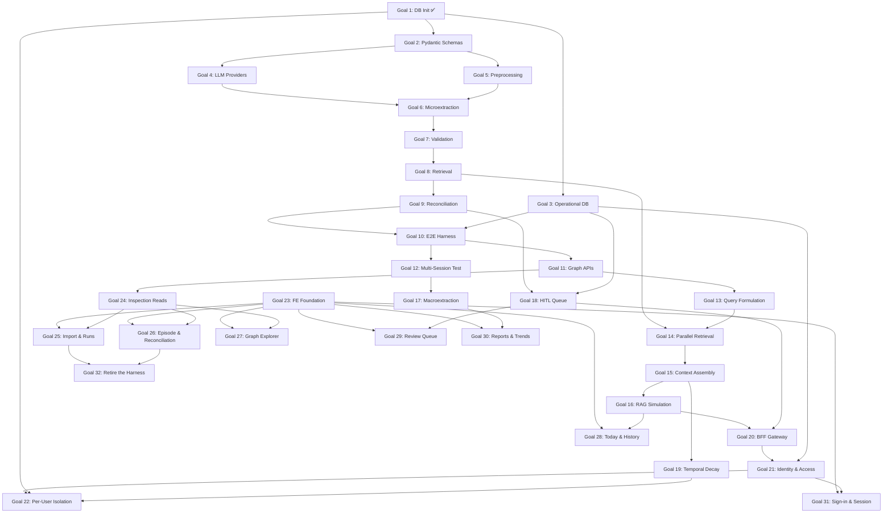

# Lumen Master Implementation Plan

This document outlines the systematic, stage-by-stage implementation plan for the Lumen project, broken down into 32 distinct, testable goals. The architecture is prioritized to build from the ground up: Foundation → Extraction → Graph Testing → Query → Insights → Identity → Front End. Goals 1–22 all develop within the `lumen/` directory as specified in [`docs/hld/Technical_HLD.md`](file:///Users/hemangmishra/Projects/Lumen/docs/hld/Technical_HLD.md); Goals 23–32 build `frontend/` beside it, with Goal 24 the one backend goal among them.

**Tech Stack:** Python 3.13, uv (package manager), Kuzu (graph), Qdrant (vector), SQLite (operational), FastAPI (API), Pydantic v2 (schemas). Front end: TypeScript, Tailwind, Radix primitives, types generated from the API's OpenAPI schema.

**Testing:** All backend goals use `pytest` + `pytest-cov`. Minimum 90% coverage target for new code. Front-end goals hold the same bar on logic — API client, hooks, state, view models — with Playwright journeys carrying the surfaces, each run in both themes and at 375px. See Phase 7's testing convention.

---

## Phase 1: Foundation & Databases (Goals 1-4)
**Objective:** Establish the data layer, schemas, and provider abstractions before touching any LLM logic.

- [x] **Goal 1: Database Initialization Protocol** ✅
  - Implemented `lumen/graph/provider.py` (GraphProvider Protocol), `lumen/graph/kuzu_impl.py` (KuzuGraphProvider with EDGE_REGISTRY), `lumen/vector/provider.py` (VectorProvider Protocol), `lumen/vector/qdrant_impl.py` (QdrantVectorProvider), and `lumen/config.py` (AppConfig).
  - Added `__init__.py` to all packages for proper Python package structure.
  - *Result:* 38 tests passing, 98% coverage. All 15 node tables and 43 edge tables created.
  - *Plan:* [`implementation/Goal_1_Plan.md`](file:///Users/hemangmishra/Projects/Lumen/implementation/Goal_1_Plan.md)

- [x] **Goal 2: Pydantic Schema Contracts** ✅
  - Implemented `lumen/schemas/{enums,base,ids,nodes,edges,pipeline}.py`: 15 node models,
    20 logical edge models + physical-table resolver, 9 pipeline DTOs, ~29 enums.
  - Added `COGNITIVE_DISTORTION_STATE`, `EXISTENTIAL_REFLECTION`, `IDENTITY_FUSION_STATE`
    to [`docs/Extraction/Microextraction.md`](file:///Users/hemangmishra/Projects/Lumen/docs/Extraction/Microextraction.md)'s enum dictionary (previously referenced by `Architecture.md` but undefined).
  - Refactored `GraphProvider.write_node()` / `KuzuGraphProvider.write_node()` to accept
    a Pydantic node model or a raw dict.
  - Redesigned the LLM routing concept per explicit user decision: replaced the old
    `RoutingTier` (`STANDARD`/`HIGH_SECURITY`, privacy-based) with `ModelRole`
    (`LIGHTWEIGHT`/`THINKING`/`EMBEDDING`/`TRANSCRIPTION`/`TTS`, capability-based).
    Added `ProviderConfig` to `lumen/config.py` as the single point of configuration —
    each role independently maps to a `(provider, model)` pair; the abstraction never
    assumes or enforces deployment locality. `DecisionAuditNode.routing_tier` renamed
    to `model_role`. Updated `Schema.md`, `Reconciliation.md`, `Preprocessing.md`,
    `Technical_HLD.md` §2.7, `LLM_Abstraction_Architecture.md`, `HLDv2.md`, and
    `LUMEN_CONTEXT.md` to match — this removes the previously-documented episode-level
    `HIGH_SECURITY` cascading-routing feature entirely (was a stated privacy guarantee;
    now privacy is a pure operator/deployment configuration choice, not a runtime
    content-routing decision).
  - Renamed `source_observation_id` → `source_node_id` on `DecisionAuditNode`,
    `ReconciliationResult`, and `RetrievalResult` — reconciliation can be triggered
    by an `EventNode`/`SessionNode`, not only an `ObservationNode`. Extended
    `branches_to` to support new `BeliefNode` creation (`branches_to_*_bel`), not
    just `PatternNode` — `Reconciliation.md` always said BRANCH could create "a
    genuinely new pattern, belief, or domain" but the edge schema never backed the
    belief case. `EDGE_REGISTRY` now has 47 physical edge tables (was 44, originally
    documented as 43).
  - *Result:* 222 tests passing (38 Goal 1 + 184 new), 100% coverage on `lumen/schemas/`
    and `lumen/config.py`. Found and flagged: Kuzu's edge DDL has no columns for
    `dialectic`/`regulates` edges' required `tension_summary`/`regulation_summary`
    fields (blocks Goal 9 until resolved).
  - *Plan:* [`implementation/Goal_2_Plan.md`](file:///Users/hemangmishra/Projects/Lumen/implementation/Goal_2_Plan.md)

- [x] **Goal 3: Operational DB Setup (SQLite + SQLAlchemy)** ✅
  - Implemented `lumen/operational/{enums,models,engine,schemas,repositories,sqlalchemy_impl,migrator}.py`
    — 8 tables, 5 repository Protocols, one SQLAlchemy implementation, Alembic migrations.
  - `session_buffer` became two tables (buffer + ordered messages); `pipeline_jobs` became
    three (`pipeline_jobs`, `pipeline_stage_runs`, `pipeline_write_log`) so per-stage metrics,
    stage replay, and the trace→graph mapping each get the shape they need.
  - Repositories accept and return Pydantic records; no ORM object leaves the package.
    A unit-of-work session manager lets several repositories share one transaction.
  - Alembic is the sole schema path — tests run `upgrade head`, and a drift test
    (`compare_metadata`) fails if `models.py` and the migration disagree.
  - `api_keys` deferred to Goal 4; HITL cap/snooze/auto-resolve deferred to Goal 18;
    erasure anonymization pass deferred to Goal 19.
  - *Amended by Goal 4:* `api_keys` was **cancelled**, not deferred — credentials come from
    environment variables and are never persisted. `resolve_provider_config()` and the
    `providers.*` settings keys were removed with it; provider selection is a deployment
    property, not a user setting. See `Goal_3_Plan.md` C7.
  - *Result:* 429 tests passing (222 from Goals 1–2 + 213 new, −6 from the Goal 4 amendment),
    100% coverage on `lumen/operational/` and `lumen/observability/`.
  - *Plan:* [`implementation/Goal_3_Plan.md`](file:///Users/hemangmishra/Projects/Lumen/implementation/Goal_3_Plan.md)

- [x] **Goal 3b: Structured Logging & Trace ID Infrastructure** ✅
  - Implemented `lumen/observability/{trace,logging}.py` — `ContextVar`-based trace ids,
    `bind_trace()` / `span()`, a JSON log formatter, and a handler-level trace filter.
  - Because the filter sits on the handler rather than on individual loggers, Goal 1's
    existing `kuzu_impl`/`qdrant_impl` log calls emit traced JSON with no code change.
  - `PipelineDTO.trace_id` now defaults from the run context, so stages never pass it by hand.
  - **Decided:** `trace_id` is *not* stored on graph nodes/edges. `pipeline_write_log` records
    what each run wrote, giving both `trace → nodes` and `node → trace`. `Technical_HLD.md`
    §10 and §4.1 updated to match (they previously specified a column that no table had).
  - *Test:* Mock 3-stage run asserts one id reaches logs, DTOs, and DB rows; two concurrent
    runs on separate threads are proven not to leak into each other.

- [x] **Goal 4: LLM Provider Abstraction Layer** ✅
  - Implemented `lumen/providers/protocols.py` (all four Protocols — the Master Plan originally
    named `llm_provider.py`, but the file holds the embedding and audio Protocols too),
    `lumen/providers/gemini.py`, `lumen/providers/ollama.py`, plus `errors.py`, `retry.py`,
    `telemetry.py`, `fake.py`, `factory.py`.
  - Implemented a role-resolution factory reading `lumen.config.ProviderConfig` (Goal 2):
    resolves a `ModelRole` to a concrete Protocol-conforming provider instance. No
    content-sensitivity branching — role selection is purely task-driven.
  - **Three roles get implementations** (`LIGHTWEIGHT`, `THINKING`, `EMBEDDING`);
    `TRANSCRIPTION` and `TTS` get Protocols only, until voice ingestion needs them.
  - Implemented embedding providers behind the `EMBEDDING` role: `text-embedding-004`
    (Gemini) and `nomic-embed-text` (Ollama) as swappable options.
  - **Configuration is maintainer-owned and deployment-time**: read from env vars at process
    start, never from `user_settings`, with credentials from the environment only. There is
    no `api_keys` table (cancelled — see Goal 3 amendment above).
  - Ship a `FakeLLMProvider`/`FakeEmbeddingProvider` in the package so Goals 5–10 can run
    end-to-end offline.
  - *Amends Goal 2's `config.py` (done):* every env var is now read when a config object is
    **constructed**, not when the module is imported — the old form silently ignored anything
    set after first import, and made the documented per-role override untestable. Credentials
    are exposed as a property rather than a field so they cannot reach
    `pipeline_jobs.config_snapshot` via `asdict()`. +24 tests; suite 429 → 453.
  - *Test:* Mock the vendor SDKs, verify prompt/response contracts, test that each role
    resolves to its configured provider and that roles are independently overridable.
    Opt-in `@pytest.mark.live` suite for real API smoke tests, deselected by default.
  - Added `lumen/providers/base.py` (not originally planned): the send/retry/time/unpack/log
    sequence lives there once, so each vendor supplies only request shaping and reply parsing.
    The fakes share it too, so tests exercise the production path.
  - *Result:* 799 tests passing (453 from Goals 1–3b + 346 new), **100% coverage** on
    `lumen/providers/` and `lumen/config.py`. Four bugs caught during implementation, including
    an unbounded `Retry-After` that could stall a run for an hour, and a shared `contextvars`
    context that fails only under real thread contention.
  - *Plan:* [`implementation/Goal_4_Plan.md`](file:///Users/hemangmishra/Projects/Lumen/implementation/Goal_4_Plan.md)

## Phase 2: Extraction Pipeline (Goals 5-9)
**Objective:** Build the core pipeline that transforms raw conversational input into structured graph actions. Each stage is a pure function (HLD Rule 2): accepts Pydantic input, returns Pydantic output.

- [x] **Goal 5: Stage 0 — Preprocessing** ✅
  - Implemented `lumen/pipeline/preprocessing/` as a package (`stage`, `transcript`, `fillers`,
    `contracts`, `prompts`, `passes`) rather than the single `preprocessing.py` named above —
    seven separable concerns that would otherwise be one 700-line file. `preprocess()` remains
    the only public name.
  - Input: `SessionDecayEvent` → Output: `PreprocessingResult`. A pure function: no DB handle,
    both LLM providers injected, runs offline against `FakeLLMProvider`.
  - **Four LLM passes, not one:** `CONVERSATION` (chat only, THINKING) rolls a dialogue up to
    its settled conclusions; `NORMALIZE` (LIGHTWEIGHT) cleans and translates; `STRUCTURE`
    (THINKING) segments into episodes and builds the coreference map; `TRIAGE` (LIGHTWEIGHT)
    scores each episode and writes reflection prompts. Cost is 1 / 3 / 4 calls per session
    depending on length and whether it was a conversation.
  - **ASR cleaning is hybrid:** regex strips only the ten hesitation spellings that can never
    mean anything; everything needing judgement (`like`, `right`, self-corrections) goes to
    the model, because the documented preservation rule is stated in terms of syntactic
    dependency and regex cannot evaluate it.
  - **The gate runs before segmentation, the score after it.** A word count short-circuits
    short entries with no reasoning call; above threshold, each episode is scored on its own,
    so one session can hold both `REFLECTION` and `RAW_CAPTURE` episodes.
  - **`DISCARD` is defined for the first time** — it fires only on a structural condition
    (nothing extractable survives filtering and cleaning), never on a coherence score. No
    model gets a vote in the one decision that throws input away.
  - **Every pass has a conservative fallback**, so a model failure loses quality but never the
    entry, and never promotes anything: failed segmentation keeps the entry whole, failed
    scoring routes to `RAW_CAPTURE`.
  - *Amends Goal 2's DTOs:* `SessionDecayEvent.source_modality` (without it Stage 0 cannot tell
    voice from typed text), `PreprocessedEpisode.episode_id` and `.episode_summary` (both
    required downstream, neither had a producer). Adds `PipelineConfig` to `AppConfig`.
  - *Docs amended ahead of coding:* `Architecture.md` (segmentation and coreference belong to
    Stage 0, not Stage 1; sub-threshold entries route to `RAW_CAPTURE`, not HITL),
    `Preprocessing.md` (the `DISCARD` rule, LLM-based language detection replacing fastText,
    reflection prompts sourced from cleaned text, Semantic Day Grouping and multi-day splitting
    moved to the ingestion layer), `Microextraction.md` (coreference example corrected to the
    shipped shape; themes/era arrive from Stage 0), `Technical_HLD.md` §5.
  - *Flagged, not fixed:* `Preprocessing.md` says `RAW_CAPTURE` extracts `CONTEXT` only;
    `Microextraction.md` says `CONTEXT` and `EMOTION`. Goal 6 owns that path and resolves it.
  - *Result:* 968 tests passing (799 from Goals 1–4 + 169 new), **100% coverage** on
    `lumen/pipeline/`, `lumen/config.py`, and `lumen/schemas/pipeline.py`.
  - *Plan:* [`implementation/Goal_5_Plan.md`](file:///Users/hemangmishra/Projects/Lumen/implementation/Goal_5_Plan.md)

- [x] **Goal 6: Stage 1 — Microextraction Core** ✅
  - Implemented `lumen/pipeline/extraction/` as a package (`stage`, `passes`, `validation`,
    `assembly`, `catalog`, `contracts`, `prompts`) rather than the single `extraction.py`
    named above — same call Goal 5 made, for the same reason. `extract()` is the only
    public name.
  - Input: **`MicroextractionInput`** → Output: `ExtractionResult`. A new stage-boundary DTO:
    `PreprocessedEpisode` carries no date, coreference map or modality, while every node this
    stage builds requires `occurred_at`. A pure function — no DB, no graph, no history.
  - **Two paths, one call each:** a `REFLECTION` episode gets one THINKING call producing
    observations, events and causal chains together; a `RAW_CAPTURE` episode gets one
    LIGHTWEIGHT call. The path is chosen from `entry_class`, which Stage 0 already decided.
  - **Goal 6 validates, Goal 7 retries** (per explicit user decision). 13 rules enforced per
    *item*: one invented type costs one observation, not the reply. Nothing is ever filled in.
    `validation_passed` is false whenever anything was dropped or nothing survived — the flag
    Goal 7 reads.
  - **Resolves the `RAW_CAPTURE` conflict Goal 5 flagged:** `CONTEXT` **and** `EMOTION`, but
    the emotion only when the person named a feeling themselves. Enforced mechanically — the
    model must return the verbatim quote, and an emotion whose quote is not in the episode
    text is dropped.
  - **The causal anchor is minted in code.** One `SessionNode` per `REFLECTION` episode, so
    Schema rule 5 (no EVOLVE without an intervening Event/Session) is a guarantee rather than
    a model judgement. `EventNode`s are still extracted from content.
  - **Three defences against invention**, all mechanical: `raw_evidence` quotes checked
    against the source text and counted when absent; a `person_ref` naming someone who appears
    nowhere in the entry is stripped; `PROSODY_SIGNAL` is excluded from the prompt and
    discarded in code, since the stage only ever sees a transcript.
  - *Amends Goal 5:* `PreprocessingResult.co_created_spans` — Stage 0's conversation pass
    detected which turns adopted an AI framing and then discarded the wording when it rolled
    the dialogue into a summary, leaving `provenance: CO_CREATED` with no possible input.
    Session-scoped like `coreference_map`, since segmentation happens later. Adds
    `make_scoped_node_id()` (`obs_2026_06_11_01_003`) — two episodes of one day are extracted
    by independent calls that both count from 1 and would otherwise collide.
  - *Docs amended ahead of coding:* `Microextraction.md` (the `RAW_CAPTURE` rule, `OPEN_LOOP`
    as an observation, provenance sourced from the adopted spans), `Preprocessing.md` (same
    `RAW_CAPTURE` rule, `co_created_spans`), `Architecture.md` (**re-extraction limit is 3,
    not 1** — it contradicted `Reconciliation.md`; the mandatory signal-floor list completed
    from 3 types to the 6 shipped; `OpenLoopNode` creation moved to Reconciliation; the
    session anchor recorded), `Technical_HLD.md` §5, `Schema.md` §3.1.
  - *Result:* 1151 tests passing (968 from Goals 1–5 + 183 new), **100% coverage** on
    `lumen/pipeline/`, `lumen/config.py`, `lumen/schemas/pipeline.py`, `lumen/schemas/ids.py`.
  - *Plan:* [`implementation/Goal_6_Plan.md`](file:///Users/hemangmishra/Projects/Lumen/implementation/Goal_6_Plan.md)

- [x] **Goal 7: Post-Extraction Validation Layer** ✅
  - Implemented `lumen/pipeline/extraction/retry.py` plus a correction prompt, correction
    validation, and failure records. Goal 6 already validated every item and dropped what
    broke a rule; this goal asks again for what a second question could plausibly fix, and
    keeps what it cannot.
  - **A correction re-asks only the refused items**, quoted back with the rule each broke.
    Items that already validated are never re-rolled, so the output is stable across
    attempts. Three attempts in total — the first reading plus two corrections.
  - **The retryable set is a frozen table of five rules**, and what is absent from it is the
    point. `QUOTE_NOT_FOUND` — the Goal 6 rule that drops a feeling the person never put
    into words — is **never** re-asked: the correction would be a direct instruction to
    produce the missing quote, and the produced one would pass the check it exists to fail.
    Four other rules are terminal for duller reasons (audio-only types, wrong path,
    one-step chains, over-limit truncation). Terminal rejections are discarded, not failed.
  - **A failed item becomes a real `ObservationNode`** with `status: EXTRACTION_FAILED`, its
    content untouched, typed `CONTEXT` because the type is usually the thing that was wrong,
    with the attempted type and the refusing rule preserved in `raw_evidence` for the review
    card. Returned on a separate `failed_observations` list so nothing downstream can mistake
    one for a real finding.
  - **An unreadable reply is re-read rather than corrected** — there is nothing to correct —
    and after the last attempt `read_failed` says so, so Goal 10 can mark the episode
    `SUSPENDED` instead of storing one that merely looks empty. Nothing is ever invented.
  - **A correction that recovers nothing ends the loop.** A model that returned an unusable
    answer once returns it again; the remaining call only pays to watch it happen.
  - *Amends Goal 6:* `ExtractionResult.failed_observations` and `.read_failed`;
    `retry_count` and `extraction_attempt` now record what actually happened rather than
    being fixed at 0 and 1. `validation_passed` now means *something was lost for good*, so
    a fully recovered reading is trusted again.
  - *Docs amended ahead of coding:* `Reconciliation.md` (**"3 re-extractions" against "on the
    third failure" resolved to three total attempts** — the same paragraph said both),
    `Architecture.md` (the retryable/terminal table with the reason each rule sits where it
    does), `Schema.md`, `Technical_HLD.md` §5.
  - *Flagged, not fixed:* `hitl_queue.audit_node_id` is `NOT NULL` and unique, but an
    extraction failure never reaches Reconciliation and so has no `DecisionAuditNode` —
    which cannot be built honestly for one. Recorded in `Schema.md` §9 for Goal 18. Also:
    the `failed_extraction` edge is `EpisodeNode → ObservationNode` only, so a failed *event*
    or *chain* has nowhere to be recorded and is discarded with a warning.
  - *Result:* 1253 tests passing (1151 from Goals 1–6 + 102 new), **100% coverage** on
    `lumen/pipeline/`, `lumen/config.py`, `lumen/schemas/pipeline.py`.
  - *Plan:* [`implementation/Goal_7_Plan.md`](file:///Users/hemangmishra/Projects/Lumen/implementation/Goal_7_Plan.md)

- [x] **Goal 8: Stage 2 — Retrieval (HyDE + Structural)** ✅
  - Implemented `lumen/pipeline/retrieval/` as a package (`stage`, `hyde`, `semantic`,
    `structural`, `hydrate`, `merge`, `contracts`, `prompts`). Input: `ExtractionResult` →
    Output: **a list of** `RetrievalResult`, one per searchable node — the Master Plan's
    singular signature was never possible.
  - **Providers are injected, like the language models.** `retrieve()` takes `GraphProvider`,
    `VectorProvider` and `EmbeddingProvider` as parameters. `Technical_HLD.md` §8 now says
    the purity rule is about writes and hidden state, not about reading — as written it read
    as though this stage could not exist.
  - **Pass A:** one batched HyDE call writes a hypothetical historical record per extracted
    node, one `embed_batch` turns them into vectors. A rich episode costs 2 calls, not 40.
    Results are hydrated from the graph, filtered, ranked on closeness × signal weight, and
    cut — with more fetched than kept, so a weighty node just below the cut on raw distance
    can climb back above it.
  - **Pass B:** three anchor lookups that read no text at all — by named person, by era tag,
    and for weighty material whose episode is still awaiting reconciliation. That third one
    is why this half exists: someone describing recovery uses none of the words they used
    describing the injury, so no measure of distance will ever connect the two.
  - **`search_failed` on the result.** A search that returns nothing and a search that could
    not run look identical from outside, and Stage 3 answers both by writing a new node —
    correct for the first, and for the second it records a long-standing pattern as a fresh
    discovery, permanently and silently.
  - *Amends Goal 1:* `hybrid_search` returns `ScoredHit` instead of bare ids — it was
    discarding the similarity that `CandidateNode` requires. `GraphProvider` gains three
    narrow anchor reads (no general query method: that would leak graph-shaped thinking into
    the pipeline). **`lumen.graph` and `lumen.vector` now export only their Protocols** —
    naming a Protocol was executing the package `__init__` and importing the vendor driver,
    so the pipeline was transitively importing both databases to name two types.
  - *Amends Goal 2:* `StructuralAnchorType.HIGH_SENSITIVITY_OPEN` — the retrieval spec has
    described three anchors all along and the enum had two, which would have failed
    `DecisionAuditNode`'s validator in Goal 9. Adds `RetrievalResult.search_failed` and four
    `PipelineConfig` limits.
  - *Docs amended ahead of coding:* `Architecture.md` (**the score formula split by layer** —
    it listed four factors while `Schema.md` listed three and the Master Plan put two of them
    in Goal 19; **Pass B's third anchor named a field that does not exist** on the node types
    it names, now stated as the two-hop lookup through the episode; sparse search called out
    as not enabled), `Schema.md`, `Technical_HLD.md` §8 and §5.
  - **Tested against real embedded Kuzu and Qdrant**, seeded per test, since every question
    this stage asks is a query and a stand-in would agree with whatever it was told.
  - *Result:* 1395 tests passing (1253 from Goals 1–7 + 142 new), **100% coverage** on
    `lumen/pipeline/`, `lumen/config.py`, `lumen/schemas/pipeline.py`.
  - *Plan:* [`implementation/Goal_8_Plan.md`](file:///Users/hemangmishra/Projects/Lumen/implementation/Goal_8_Plan.md)

- [x] **Goal 9: Stage 3 — Reconciliation Logic** ✅
  - Implemented `lumen/pipeline/reconciliation/` as a package (`stage`, `decide`, `gates`,
    `plan`, `promote`, `people`, `catalog`, `contracts`, `prompts`) rather than the single
    `reconciliation.py` named above — same call as Goals 5–8. `reconcile()` is the only
    public name.
  - Input: `ExtractionResult` + `list[RetrievalResult]` → Output: **`ReconciliationOutcome`**,
    a new DTO. An episode produces many decisions, many audit nodes, and the writes they
    imply; they have to arrive together or Goal 10 cannot execute them atomically.
  - **Stage 3 decides and builds; it writes nothing.** It returns a `GraphWritePlan` — the
    exact nodes, edges and bookkeeping the decisions imply, fully built and validated —
    which Goal 10 executes without interpreting. The plan checks its own consistency on
    construction, so a dangling reference fails while planning rather than halfway through
    saving.
  - **One cheap call per episode, one deep call for anything consequential** (per explicit
    user decision). `EVOLVE`/`CONTRADICT`/`DIALECTIC` are re-asked with the THINKING model,
    which may confirm, lower confidence, or overrule downward — it is shown only the risky
    items, so it can never make one heavier. Typical cost: 1 call; 2 when something is
    claimed to have changed.
  - **Seven gates enforced in code after the model answers**, in a fixed order: is the
    action structurally possible (falls to the runner-up, then to review), is it a tie
    (<0.05 → AMBIGUOUS), is it a first deviation from a belief older than 180 days
    (→ recorded separately, with a named-breakthrough bypass), is it a short spike inside a
    longer stretch, does a change have a cause, does the action carry the sentence it needs,
    and is it confident enough. Below-threshold is **never** downgraded to BRANCH.
  - **Only claim-like observation types become standing records** (per explicit user
    decision). A frozen table covers all ~50 types with a completeness test; the ~30
    non-promotable ones still reconcile — they can MERGE, REINFORCE or REGULATE — but never
    create a new belief or pattern.
  - **Person records and open-loop promotion ship here** (per explicit user decision). This
    closes the loop Goal 8 left open: its named-person anchor had nothing to find because
    nothing had ever created a person record. Cross-entry alias matching stays deferred.
  - **The append-only rule is restated as what it means: no *content* field is ever
    modified** (per explicit user decision). Three named bookkeeping operations —
    `mark_superseded`, `record_reinforcement`, `touch_person` — touch fixed counters,
    timestamps and version status with no caller-supplied field names. Named openly in
    `Schema.md` rather than left as a hidden exception.
  - **An undecidable item waits alone** (per explicit user decision). The rest of the
    episode is written; the episode is marked `SUSPENDED` to say something is outstanding.
    `find_unresolved_high_signal` was widened to match, or it would stop finding exactly
    the items this stage sets aside.
  - **Goal 8's `search_failed` is honoured:** an item whose search failed is never branched
    and never even asked about — it waits for a person, since novelty cannot be claimed
    from a search that did not run.
  - *Amends Goal 1/2:* the `dialectic` and `regulates` edge tables gain the summary columns
    Goal 2 flagged as blocking this goal (writing either would have failed); `decided_by_sess`
    added — a session is one of three things this stage decides about and was the only one
    unable to record its own decision (47 → 48 physical edge tables); `count_prior_decisions`
    plus the three bookkeeping writes added to `GraphProvider`. `HitlEntryType` moved to
    `schemas/enums.py` so the pipeline names it without importing SQLAlchemy.
  - *Docs amended ahead of coding:* `Reconciliation.md` (**"Rule R5"/"Rule R6" never
    existed** — the table has always had three and R6's text was word-for-word R3's;
    **`LOCAL_EXTREMUM`/`BASELINE_SHIFT` name tags nothing in the system produces**, restated
    as a per-item judgement the decision call returns; **rollback pointed at an edge id that
    does not exist** — edges have no id column, so `decision_id` is the handle; the promotion
    table; the two-call model policy; partial suspension), `Architecture.md`, `Schema.md`
    (the bookkeeping exception, the two edge columns, `decided_by_sess`, `evidence_count` as
    stored rather than derived), `Technical_HLD.md` §5 and §8.
  - *Result:* 1649 tests passing (1395 from Goals 1–8 + 254 new), **100% coverage** on
    `lumen/pipeline/reconciliation/`, `lumen/schemas/pipeline.py`, and `lumen/config.py`.
  - *Plan:* [`implementation/Goal_9_Plan.md`](file:///Users/hemangmishra/Projects/Lumen/implementation/Goal_9_Plan.md)

## Phase 3: Graph Construction & E2E Testing (Goals 10-12)
**Objective:** Tie the extraction pipeline to the databases, execute full runs, and manually inspect the graph.

- [x] **Goal 10: End-to-End Extraction Pipeline Harness** ✅
  - Implemented `lumen/pipeline/orchestration/` as a package (`runner`, `episode`,
    `compose`, `embed`, `commit`, `contracts`, `bookkeeping`) rather than the single
    `orchestrator.py` named above — same call as Goals 5–9. `run_pipeline()` and
    `repair_index()` are the only public names.
  - Input: `SessionDecayEvent` → Output: **`RunReport`**, carrying one `EpisodeOutcome`
    per episode. Every store and model is injected, so the signature is a complete
    statement of what a run can touch.
  - **A plain synchronous function, not a queued task** (per explicit user decision).
    Redis/RQ and the idle-conversation watcher move to Goal 20, where a long-running
    process exists to host them; Goals 11–12 want ordered runs anyway.
  - **An episode saves whole or not at all** (per explicit user decision). Added
    `GraphProvider.transaction()` — the database always supported it and we had never
    exposed it. Nesting is refused rather than silently flattened.
  - **Episodes fail independently** (per explicit user decision). One bad topic does not
    cost the other three; the `follows_from` chain is built against the last episode that
    actually committed, never one whose transaction was rolled back.
  - **The orchestrator writes the half Stage 3 never sees:** the `EpisodeNode` — which
    nothing had ever created despite every stage naming it — plus `contains_*`,
    `chain_contains`, `failed_extraction` and `follows_from`. Merged with Stage 3's plan
    into one `GraphWritePlan`, so its three validators cover the whole episode.
  - **Vectors are computed before the transaction opens** (per explicit user decision), so
    an embedding failure costs nothing. Only the index write happens after the commit; if
    it fails the records are kept, the run reports failure, and `repair_index()` recovers
    them from the write log — node writes and vector writes are logged separately, so the
    difference between the two lists *is* the repair set. `INDEXED_NODE_TYPES` **is**
    retrieval's `CONTENT_TABLES`, asserted identical, so the two cannot drift.
  - **Re-running skips whole episodes, not just their saving** (per explicit user
    decision). Skipping only the write would re-decide an entry against a graph holding
    its own previous conclusions and record it as a repeat of itself.
  - **Undecided items reach the review queue now** (per explicit user decision), keyed on
    the audit node so a re-run never asks twice. Cap/snooze/auto-resolve stay Goal 18's;
    extraction failures still cannot be queued (`hitl_queue.audit_node_id` is `NOT NULL`
    and they have no audit node).
  - **The coreference map finally has a home** (per explicit user decision): a
    `coreference_maps` table in the operational DB, id derived as `coref_<entry_id>`.
    `EpisodeNode.coreference_map_id` had always pointed at something nothing stored.
  - *Amends Goal 9:* audit ids are now episode-scoped (`d_2026_06_11_01_001`) — two
    episodes of one day both numbered their notes from one and collided on a duplicate
    key, a bug only reachable once something ran two episodes in a row. *Amends Goal 5:*
    `PreprocessingResult.detected_languages` — `EpisodeNode.language_tags` had no producer,
    so a Hindi entry would be stored as English with nothing saying it was translated.
    *Amends Goal 1:* Kuzu rollback tolerates the database having already abandoned the
    transaction, which was replacing every real failure with a complaint about cleanup.
    *Amends Goal 3:* `episode_id` on `pipeline_stage_runs` and `pipeline_write_log`,
    uniqueness moved to `(job, stage, episode, attempt)`, migration `0002_orchestration`.
    `PipelineStage` moved to `schemas/enums.py` — the same move Goal 9 made for
    `HitlEntryType`.
  - *Narrowed, not deleted:* Goals 5 and 6 asserted that nothing in `lumen/pipeline/`
    imports `lumen.operational`. That rule protects stage purity, and persistence is the
    orchestrator's entire job; both guards now name the four stage packages individually.
  - *Test:* A real journal entry read from a file produces episode/observation/event/
    session/pattern/person/audit records in a real Kuzu database and matching vectors in a
    real Qdrant collection — verified by reading both stores back, not by trusting the
    report.
  - *Result:* 1799 tests passing (1649 from Goals 1–9 + 150 new), **100% coverage** on
    `lumen/pipeline/orchestration/` and `lumen/operational/`, 98% on `lumen/graph/`.
  - *Plan:* [`implementation/Goal_10_Plan.md`](file:///Users/hemangmishra/Projects/Lumen/implementation/Goal_10_Plan.md)

- [x] **Goal 11: Graph Read & Debug APIs** ✅
  - Implemented seven named traversals on `GraphProvider` (`find_nodes`, `get_neighborhood`,
    `get_version_chain`, `get_decision_history`, `get_episode_contents`, `get_causal_chain`,
    `count_by_type`) plus `lumen/graph/queries.py` for filter composition and row tidying —
    `kuzu_impl.py` was already ~800 lines and the fiddly half is checkable with no database.
  - Implemented `lumen/api/` (`main`, `deps`, `schemas`, `errors`, `routes/graph`,
    `routes/debug`) — eleven read-only endpoints, the project's first HTTP surface.
  - **No general query method, and Goal 1's `execute_cypher()` is cancelled rather than
    deferred again.** It would push query building out to callers, spread Cypher into the
    web layer, and end the promise that Kuzu can be swapped for Neo4j. Anything the system
    cannot answer is now a deliberate addition, visible in review.
  - **`ReadOnlyGraph` extracted; `GraphProvider` extends it.** The API is handed the
    narrower type, so a write endpoint is not merely discouraged — the method is not on the
    object it was given. Asserted by a test, along with "every exposed verb is GET".
  - **Nothing raw crosses the boundary.** A node read from Kuzu arrives as the union of
    every column across every table — 121 fields, almost all empty, lists stored as text.
    Responses are tidied, checked models instead.
  - **`truncated` on every subgraph.** A piece that was cut and a piece that was genuinely
    that size look identical otherwise, and a partial graph drawn as a complete one is a
    wrong answer that looks right. Depth is capped at three hops.
  - **Time travel is a filter, not a feature:** `as_of` compares `valid_from`, and a link
    withdrawn *after* that date was still live then. Withdrawn links are hidden by default
    and reachable on request.
  - *Amends Goal 8:* `find_linked_to_person` now takes the second hop it recorded as
    "belongs with Goal 11's traversal work" — beliefs and patterns reached through the
    observation that produced them, withdrawn links not followed, duplicates offered once.
  - *Bugs found by running it:* `OpenLoopNode` has `resolution_status`, not `status`, and
    four tables have no `valid_from` at all — both would have crashed an ordinary listing
    rather than returning nothing, so both lists are now derived from the schema with a
    test asserting every named column exists. And **a node's shape depends on how it was
    fetched** (121 columns untyped, 21 typed), which made a version chain describe the same
    history differently depending on where the walk started; chains now collect ids and
    fetch once.
  - *Test:* The API tests build their graph by **actually running the pipeline** on Goal
    10's entry rather than seeding fixtures — a hand-seeded graph agrees with whatever
    shape the test author imagined.
  - *Result:* 1937 tests passing (1799 from Goals 1–10 + 138 new), **100% coverage** on
    `lumen/api/` and `lumen/graph/queries.py`, 99% on `lumen/graph/`.
  - *Plan:* [`implementation/Goal_11_Plan.md`](file:///Users/hemangmishra/Projects/Lumen/implementation/Goal_11_Plan.md)

- [x] **Goal 12: Multi-Session Integrity** ✅
  - Implemented `lumen/simulation/` (`corpus`, `themes`, `runner`, `__main__`) — five
    consecutive days written as a journal with an arc, a stand-in embedder that clusters
    by theme, and one call that feeds the days through the real pipeline in order.
  - **The corpus ships in the package, not the test folder.** Phase 3's objective is to
    "manually inspect the graph" and there was no way to fill one; `python -m
    lumen.simulation` now does it in one command. Same precedent as Goal 4's fakes.
  - **A themed stand-in embedder was necessary, not convenient.** The existing one hashes
    text, so two entries about one struggle land as far apart as two unrelated ones —
    under it the pipeline *must* fragment, and the test would have failed for a reason
    that has nothing to do with the pipeline. The new one is *told* the theme rather than
    inferring it, and says so.
  - **The four integrity properties hold:** one theme across five days is one pattern with
    `evidence_count` 3; a belief created on day 4 and evolved on day 5 forms a linked
    version chain with exactly one current version and the older kept; every record traces
    to its entry, run and decision; the two episodes of one day are ordered. Running the
    same week twice produces the same graph.
  - **Assertions read through Goal 11's API** where possible, so the test exercises what a
    person would actually use.
  - *Amends Goal 9 — two real bugs, both unreachable from a single entry:*
    **a person mentioned again on a later day crashed the whole episode** (they are found
    rather than created, so nothing in the plan created them and the link to them looked
    like it pointed at nothing — `_known_ids` now counts every bookkeeping target as an
    existing record); and **a standing record could not report its own decision history**,
    because `decided_by` was written only from the finding, leaving three of the six link
    tables unreachable and "why does the system believe this?" unanswerable from the
    record itself.
  - *Amends Goal 8/11:* retrieval's `PERSON_LINKED_TYPES` gains `PatternNode` and
    `BeliefNode`. Goal 11 built the second hop and nothing called it, so a person named
    again surfaced only individual notes and never the pattern they produced.
  - *Corpus changed after the fact, recorded in Section C:* day 4's observation type
    (the deciding model's `new_node.kind` is asked for and never read — what a finding
    becomes is decided by its type), day 5's action (a version chain needs an EVOLVE and
    nothing evolved), and day 5's wording (it claimed a theme its words no longer
    contained — caught by a corpus test).
  - *Test:* 60 new tests. The five days run against real Kuzu and Qdrant; an opt-in live
    variant runs the same corpus against real models and is deselected by default,
    because whether a real model recognises Wednesday from Monday is a question about
    prompts that can change without this repository changing.
  - *Result:* 2010 tests passing (1937 from Goals 1–11 + 73 new), **100% coverage** on
    `lumen/simulation/` and `lumen/pipeline/reconciliation/`.
  - *Plan:* [`implementation/Goal_12_Plan.md`](file:///Users/hemangmishra/Projects/Lumen/implementation/Goal_12_Plan.md)

## Phase 4: Query Layer (Goals 13-16)
**Objective:** Build the real-time, invisible RAG injection system per [`docs/Query/Conversational_RAG_Mode.md`](file:///Users/hemangmishra/Projects/Lumen/docs/Query/Conversational_RAG_Mode.md).

- [x] **Goal 13: Query Formulation Layer** ✅
  - Implemented `lumen/query/` as a new **top-level** package (`session`, plus
    `formulation/{stage,contracts,prompts,triage,safety,grounding,deadline}`) rather than
    a module under `lumen/pipeline/`. Two rules that protect the pipeline do not apply
    here and would read as violations if it lived there: this layer only reads, and it
    holds state for as long as a conversation lasts. `QueryFormulator` is the only
    public name.
  - Input: `ChatTurn` + `ChatSession` → Output: `RetrievalSignal`. Built as an object
    rather than a pure function because it owns a thread pool with a lifetime; the
    model, the graph and the configuration are all injected.
  - **The crisis judgement is not left to the model alone** (per explicit user decision).
    A frozen list of unambiguous distress phrases sits underneath it in plain code. The
    model may *escalate* a turn to `CRISIS`; it can never lower one the floor set, and a
    floor hit makes no model call at all. Being wrong in the permitted direction costs
    one skipped lookup — the cheapest possible way to be wrong about the one thing that
    matters most.
  - **Triggers are grounded against the graph before they leave** (per explicit user
    decision). This exists because of a schema fact: era columns are **free text with no
    controlled vocabulary**, so a model confidently answering `HIGH_SCHOOL` against a
    graph storing `high school years` retrieves nothing, silently, forever. The fix is
    to hand the model the user's real era names and reject anything outside them. A
    person with no record and an `OPEN_LOOP_MATCH` with no open loops are dropped the
    same way — an ungrounded trigger spends Goal 14's whole 3-second budget proving it.
  - **Pure acknowledgements skip the model** (per explicit user decision) on a frozen
    exact-match list, deliberately **not** a length rule: the shortest turns in this kind
    of conversation are frequently the heaviest, and "I can't anymore" is four words.
  - **The day-session lives here** (per explicit user decision). `ChatSession` /
    `SessionRegistry` hold the recent turns and the sensitive domains the user opened
    themselves; asking for a session on a new date replaces the old one, which is the
    entire midnight rule with no timer and no sweep. Goal 14 attaches its buffer to the
    same object.
  - **The `<100ms` budget was not reachable and is corrected** (per explicit user
    decision). A real hosted call takes 300–800ms, so the shipped form is a configurable
    600ms hard deadline; the call is abandoned past it and the turn proceeds with no
    retrieval. Enforced from outside via a bounded thread pool, since no provider has a
    per-call timeout — with the trace context copied across by hand, and the abandoned
    call logged when it eventually lands, because a thread cannot be cancelled.
  - **Retries are switched off for this one model** — every other call in the system
    retries with backoff, which is right for work nobody is waiting on; a classifier that
    retries has already lost its deadline twice over.
  - *Amends Goal 11:* `list_era_tags()` added to `ReadOnlyGraph` — a named read, not a
    general query, existing because era tags are uncontrolled free text. `era_key()` in
    `graph/queries.py` is the shared comparison rule, so the store and its callers cannot
    disagree about whether two spellings are one period. **The API gained its first POST**
    (`/query/formulate`): it changes nothing, but a GET would put somebody's sentence
    about their own life into every access log between here and the server. Goal 11's
    "every verb is GET" assertion is narrowed to the routers it was about, and a second
    test pins the one exception.
  - *Amends Goal 9:* `person_node_id()` moved to `schemas/ids.py` with the rest of the
    id policy — the pipeline derives it when recording somebody named in an entry, and
    this layer derives it when checking a name just spoken. Two copies that drifted
    would mean the second never finds what the first wrote.
  - *Fixed while wiring:* a missing model credential made the whole read API refuse to
    start. Every other thing it does reads two local databases and needs no model, so the
    failure is now confined to the one surface that needs one, which answers 503 saying
    exactly that.
  - *Docs amended:* `Conversational_RAG_Mode.md` (the latency correction and why
    carry-forward does not apply to it, the crisis floor as a code-level guarantee, era
    grounding, and an example `domain` that was not one of the eleven real ones),
    `Technical_HLD.md` §3.1 and §6, `Schema.md` (a new section stating that era tags are
    uncontrolled free text and what follows from it).
  - *Test:* 220 new tests, plus 10 more that are deselected by default. Grounding runs
    against real embedded Kuzu, since every
    question it asks is a query and a stand-in agrees with whatever it is told. An opt-in
    live suite asks a real model whether it reads the spec's own sentences the way the
    design assumes — deselected by default, because that is a question about prompts.
  - *Result:* 2230 tests passing (2010 from Goals 1–12 + 220 new), **100% coverage** on
    `lumen/query/`, `lumen/api/`, `lumen/schemas/query.py` and `lumen/graph/queries.py`.
  - *Plan:* [`implementation/Goal_13_Plan.md`](file:///Users/hemangmishra/Projects/Lumen/implementation/Goal_13_Plan.md)

- [x] **Goal 13b: Import & Inspection Surfaces** ✅
  - An insert, in the manner of Goal 3b, and the reason is that Goals 14–16 tune retrieval
    against a graph that until now could **only** be populated by `lumen/simulation/`'s
    hand-written corpus — four days composed specifically to exercise the stages. Tuning
    retrieval against that is tuning it against itself.
  - **`lumen/ingest/`**: `parse_export()` is a pure function (decoded JSON in, DTOs out,
    no DB, no clock, no config); `stage_conversations()` writes only through the
    repository methods a live conversation already uses; `IngestWorker` runs the shipped
    `run_pipeline` on one background thread and is the only thing that can write.
  - **One logical date per conversation, taken from its first message** (per explicit user
    decision) — a reflection running past midnight belongs wholly to the day it started,
    because splitting it would make reconciliation compare an evening against its own
    earlier conclusions. `LUMEN_IMPORT_TIMEZONE` decides which calendar that day is in;
    an export records an instant, and only the reader knows the calendar.
  - **The format is not the official OpenAI export** — one conversation per file, flat
    message list, no branch walking. Assistant turns are kept, because `co_created_spans`
    can only be found while the dialogue is still turn-by-turn.
  - **The read-only guarantee is narrowed, not dropped.** No route can reach a graph write;
    the upload routes hold the worker and can only queue an identifier. Pinned by three
    tests including an allow-list of the three POSTs with a written reason each.
    `LUMEN_ENABLE_INGEST=false` removes the routes entirely rather than answering 503.
  - **An upload is refused before anything is written** if no model is reachable — 503,
    not a failure discovered four minutes later that reads as a bad export.
  - *Amends Goal 1:* **`KuzuGraphProvider` is now safe for one writer plus readers.** Kuzu
    takes a file lock, so a server that both reads and imports *must* share one provider —
    and a transaction belongs to the connection, so without a lock a read arriving
    mid-import would run inside the importer's uncommitted transaction. Every statement now
    goes through a guarded `_execute`; `transaction()` holds a re-entrant lock for its
    length. Same-thread nesting still raises; another thread now waits.
  - *Amends Goal 1:* **`LUMEN_VECTOR_LOCATION` never actually accepted a path.** The
    client's `location` is a *host*, so `./lumen_vectors` was resolved as a DNS name and
    failed. Found by running the service, not by the suite — nothing had ever configured a
    persistent vector store.
  - *Amends Goal 3b:* `extra={"filename": ...}` raises `KeyError` from inside the logging
    call and **never fires under pytest**, which leaves logging at WARNING. One shipped in
    this goal and would have failed every upload. A syntax-tree guard now covers every log
    line in the package; it found two pre-existing `extra={"trace_id": ...}` lines in
    `orchestration/embed.py` that `TraceIdFilter` was silently overwriting.
  - *Amends Goal 11:* `GET /debug/traces` — every other debug endpoint is keyed by a trace
    id and nothing handed one out. Plus `PipelineJobRepository.list_recent()`.
  - *New:* `imports` table (migration `0003`), `.env.example`, `lumen/env.py`,
    `python -m lumen`, and a deliberately plain test UI at `/ui` — vanilla HTML, no build
    step, meant to be deleted when the real front end is designed.
  - *New:* an **episode page** — one piece of writing next to everything made of it, with
    every property of every record rather than a chosen few. The writing itself needed
    `GET /debug/episodes/{id}/source`: an episode keeps a summary and a hash of its text
    and never the text, so this walks node → run → conversation and reads it from the
    operational store.
  - *Amends Goal 4:* **Gemini refused every structured call.** The contracts set
    `extra="forbid"`, Pydantic writes that as `additionalProperties`, and the API rejects
    a request naming a field it does not have — so each stage fell back to its safe answer
    and the run reported COMPLETE having extracted nothing. The schema is now sanitised at
    the provider boundary; the reply is still validated against the real class.
  - *Amends Goal 4:* **a failed model call now says why in words.** `error_type` alone
    cannot tell a retired model from a malformed request, which are different problems
    with different fixes; diagnosing the above needed a live probe rather than the log.
  - *Amends Goal 1:* **a vector collection built for a different model is refused at
    startup.** Changing the embedding model changes its width, and the mismatch used to
    surface once per record, mid-run, while the graph kept saving records nothing could
    find.
  - *Amends Goal 1:* **`get_nodes_by_ids` could not read two kinds of record at once.** An
    unlabelled match spanning two node tables comes back with its strings misread and
    fails to decode; it now asks one table at a time, preserving the caller's order. This
    was waiting for Goal 14 — fetching mixed candidates by id is the method's whole job.
  - *Amends Goal 3b:* **the suite was writing into the log the service uses.**
    `configure_logging` attaches to the root logger and nothing detaches it, so one test
    entering an app lifespan redirected the rest of the session into `logs/lumen.jsonl` —
    scripted failures sitting in the production log looking real.
  - *Test:* 592 new tests. The worker's happy path is a real run against real Kuzu and
    Qdrant with stand-ins only where a model would be. Driven by hand end to end: uploaded,
    processed, 9 records and 8 links written, readable on the trace page, re-upload
    deduped — which is how both real bugs above were found.
  - *Result:* 2822 tests passing (2230 from Goals 1–13 + 592 new), **100% coverage** on
    `lumen/ingest/`, `lumen/api/` and `lumen/env.py`.
  - *Plan:* [`implementation/Goal_13b_Plan.md`](file:///Users/hemangmishra/Projects/Lumen/implementation/Goal_13b_Plan.md)

- [x] **Goal 14: Parallel Retrieval Passes (A, B, C)** ✅
  - Implemented `lumen/query/retrieval/` (`stage`, `semantic`, `structural`, `continuity`,
    `hyde`, `hydrate`, `gate`, `merge`, `contracts`, `prompts`) plus `lumen/query/buffer.py`.
    `ConversationalRetriever` is the only public name. Input: `RetrievalSignal` +
    `ChatSession` → Output: `RetrievalBundle`.
  - **A and B are parallel; C is not, and cannot be** (per explicit design decision). Pass C
    measures today's already-surfaced records against *this* turn, and the measurement it
    needs is the one Pass A has just computed. Giving it its own embedding call would double
    the cost of a turn to learn nothing. It runs afterwards on numbers in memory, in about a
    millisecond. The spec called all three parallel and is corrected.
  - **Three seconds is one shared wall clock**, enforced from outside as Goal 13's 600ms is.
    Whatever finished is returned; whatever did not is abandoned and *reported* as abandoned.
    A pass that fails costs that pass — losing the semantic half does not lose the anchors.
  - **The four empty answers stay distinguishable**: nothing worth looking up, somebody in
    acute distress, the search ran and found nothing, and the search could not run. Goal 8's
    hardest-won lesson, restated for a layer where the wrong reading makes a system built to
    remember behave as though it had never met anyone.
  - **The sensitivity gate ships here**, at the retrieval boundary rather than at injection,
    so a locked record never leaves the search. Two rules the spec left open are settled:
    the sensitive domains are `SELF_CONCEPT`/`RELATIONAL`/`HEALTH`/`SPIRITUALITY` — **not**
    `EMOTIONAL`, which in this kind of conversation would gate the whole graph — and a
    CRITICAL record with **no** domain (every individual observation) is treated as
    sensitive until the person opens some sensitive subject. Withheld ids are named on the
    result, never silently dropped.
  - **The buffer deadlock is settled too.** Five slots and "CRITICAL is never evicted" means
    a day can fill with protected records and admit nothing new; a record that cannot get a
    slot is still offered this turn and simply does not join the thread.
  - **Ranking here is provisional and says so.** `cosine × signal_weight × session_boost`,
    with `recency_weight` deliberately absent (Goal 19) and final ranking + the ≤400-token
    compression left to Goal 15. An anchor match carries **no** `similarity` at all — an
    exact name match is not a measurement — and is ordered by a configured base value.
  - *Amends Goal 13:* `deadline.py` moved to `lumen/query/` and gained `run_all()`; both
    halves of the query layer need it. **A real bug surfaced only by the parallel form:** one
    `contextvars.Context` cannot be entered by two threads at once, so a single shared copy
    made every piece after the first fail — invisibly, since it looks like a provider error.
  - *Amends Goal 8:* row reading (`preview_of`, `signal_of`, `CONTENT_TABLES`,
    `RETIRED_STATUSES`, `SIGNAL_WEIGHT`) moved to `lumen/graph/rows.py`, so the two retrieval
    layers cannot drift on what a stored row says. The pipeline's modules re-export.
  - *Amends Goal 1:* `VectorProvider.get_vectors()` — a stored record's position could not be
    read back at all, and the continuity check needs it to compare without searching. Vectors
    come back normalised, which is what the collection stores.
  - *Amends Goal 13b:* `POST /query/retrieve` — the reading endpoint answers whether the
    router is any good; this answers whether the searches find the right things, and is the
    only way to see the continuity pass, which needs a conversation longer than one turn.
    `LazySearchStack` shares the importer's index rather than opening a second.
  - *Docs amended ahead of coding:* `Conversational_RAG_Mode.md` (the parallelism correction,
    where Pass C's numbers come from, the buffer deadlock, the two sensitivity rules, the
    score split by layer, Pass A's unreachable 800ms budget, and `PROGRESS_CLAIM`'s
    previously-undefined "closure detection"), `Technical_HLD.md` §3.1 and §6.
  - *Test:* Against real Kuzu and real Qdrant, seeded per test. The Master Plan's named case
    — a `HISTORICAL_ERA` turn surfacing what is filed under that era — is asserted both at
    the pass and through the whole component.
  - *Result:* 3213 tests passing (2822 from Goals 1–13b + 391 new), **100% coverage** on
    `lumen/query/`, `lumen/graph/rows.py` and `lumen/api/`.
  - *Plan:* [`implementation/Goal_14_Plan.md`](file:///Users/hemangmishra/Projects/Lumen/implementation/Goal_14_Plan.md)

- [x] **Goal 15: Context Assembly, the Voice, and Conversation Memory** ✅
  - Implemented `lumen/query/assembly/` (the briefing), `lumen/query/prompting/` (the voice
    and `PromptComposer`), `lumen/query/memory/` (the conversation's own memory) and
    `lumen/query/conversation.py` (holding a chat). Output: **`ChatPrompt`** — exactly what
    the assistant would be sent, as one inspectable object.
  - **The ≤400-token cap is replaced by an allowance that fits the moment** (per explicit
    user decision): nothing in crisis, ~400 tokens and no quotes when raw, ~800 ordinary,
    ~1500 when thinking something through. Not a cost decision — a wall of history in front
    of a light question makes the answer worse.
  - **Retrieval's budget rises from 3s to 8s** (per explicit user decision). A brief pause
    before a considered reply reads as thought; an answer that missed the one relevant thing
    reads as nothing.
  - **A chat is written into the buffer the pipeline already reads.** `NATIVE_CHAT` has been
    a valid source since Goal 3 and the live session's identity was built to match, so
    following it makes today's conversation become tomorrow's graph with nothing to copy
    across.
  - **Editing branches; nothing said is destroyed.** Messages carry a parent, the buffer
    names the live end, and an edit writes a sibling — the graph's append-only instinct
    applied to conversation. **The pipeline extracts the active thread only**, because a
    message somebody took back is not what they settled on.
  - **Memory is the recent turns verbatim plus a stored rolling summary**, refreshed every
    few turns by one cheap call made *after* a reply goes out. Each refresh folds the
    previous summary plus what has been said since, so a three-hour chat costs what a
    ten-minute one does.
  - **In crisis the instructions change, not just the context.** Withholding the history
    while still asking for curiosity and pattern-noticing would be half a decision.
  - *Amends Goal 13:* the query layer now writes — conversations, never the graph. Stated in
    the package docstring and the HLD rather than glossed.
  - *Bug caught by a test:* the briefing lowercased first words and turned "Alex called
    about it" into "alex called about it". Records keep their own capitalisation now — names
    are the one thing a briefing about somebody's relationships must not mangle.
  - *Docs amended:* `Conversational_RAG_Mode.md` (the allowance table, the template rules,
    the crisis prompt switch, conversation storage and branching, chat memory, and the
    superseded 3-second window), `Technical_HLD.md` §3.1 and §6.
  - *Result:* 3433 tests passing (3213 from Goals 1–14 + 220 new), **100% coverage** on
    `lumen/query/` and `lumen/operational/`.
  - *Plan:* [`implementation/Goal_15_Plan.md`](file:///Users/hemangmishra/Projects/Lumen/implementation/Goal_15_Plan.md)

- [x] **Goal 16: The Conversation Itself — Streaming, Voice, and Continuity Across Days** ✅
  - Implemented `lumen/query/chat/` (`ChatEngine` and the events one turn emits),
    `lumen/chat/` (the wiring, and `python -m lumen.chat`), `lumen/providers/audio.py`,
    `lumen/query/memory/earlier.py`, `lumen/api/routes/chat.py`, migration `0005_voice`.
  - **Real streaming, at the connector layer** (per explicit user decision). The
    alternative — waiting for the finished reply and revealing it gradually — looks
    identical and helps nobody. Ships as `StreamingLLMProvider`, a separate interface,
    so nothing that only wants a finished answer has to care.
  - **A streamed reply cannot be retried.** Every other call in Lumen tries again on
    failure, which is safe because nobody saw the failed attempt. Words on a screen
    cannot be un-said, so a break ends the reply, reports what was already said, and
    stores it. A failure *before* any words is an ordinary failed call.
  - **`ModelRole.CONVERSATION`** (per explicit user decision) — a fifth role, so the
    model that writes a warm reply in under a second is configured independently of the
    one doing overnight extraction reasoning.
  - **Continuity across days** (per explicit user decision): the last three days'
    own summaries, free, because every day already writes one. Counts **days that hold a
    conversation** rather than calendar days, reaching back a fortnight — somebody who
    journals twice a week would otherwise get nothing, which is the case it is for.
    Crossing midnight forces one summary of the day just ended, or short days would
    carry nothing. The day boundary is unchanged; the retrieval working set still
    resets at midnight.
  - **A day is frozen once it has become history** (per explicit user decision), and the
    refusal offers the thing actually wanted: say it again today. Necessary because an
    episode is stored under its *date*, not its content — a re-run of an edited day
    finds it already saved and skips it, leaving the conversation and the graph
    permanently disagreeing with nothing reporting it. A hash comparison now warns when
    a skipped episode's words have changed, covering the other roads to that state.
  - **Carry-forward ships**: a search that misses its budget is caught when it lands and
    used on the next turn, ranked at 0.9× and **re-checked against the sensitivity
    gate** — the pass that would have gated it never finished. Carried one turn only.
  - **Voice both ways** (per explicit user decision), with the reply spoken once
    finished rather than sentence by sentence. Both protocols now take and return audio
    rather than file paths. Speech to text is the one job with **no local option**, and
    the error says so.
  - *Amends Goal 15:* **the first turn of a conversation could never be summarised** —
    arrival numbers start at zero and so does the summary mark, and the comparison was
    strictly greater, so every conversation's opening was excluded from its own summary.
  - *Amends Goal 4:* a reply stopped by a safety filter **mid-stream** read as a short
    answer; the refusal check now lives in one place both shapes of reply use.
  - *Test:* a week built by the real pipeline, then a real conversation against it —
    real Kuzu, real Qdrant, real engine, scripted models. Plus `python -m lumen.chat`,
    which is where reply quality is actually judged.
  - *Result:* 3684 tests passing (3462 after the pre-goal review + 222 new), **99%
    coverage**; the ten uncovered lines are the `__main__` guard, three unreachable
    defensive branches, and four that predate this goal.
  - *Plan:* [`implementation/Goal_16_Plan.md`](file:///Users/hemangmishra/Projects/Lumen/implementation/Goal_16_Plan.md)

## Phase 5: Insights & Macro Layer (Goals 17-20)
**Objective:** Build background intelligence processes and the unified API gateway.

- [x] **Goal 17: Periodic Macroextraction** ✅
  - Implemented `lumen/pipeline/macroextraction/` — a package rather than one module:
    `windows` (calendar arithmetic and what is overdue), `corpus` (the only reader),
    `analytics`/`aging`/`shifts` (every number, pure), `narrative`/`prompts` (every
    sentence), `assemble`, `commit` (the only writer), `runner`, and `service` (the narrow
    surface the web layer holds). Report types SHADOW, WEEKLY, MONTHLY, QUARTERLY; each run
    writes a `MacroextractionReportNode` plus one `analyzed_in` edge per episode read.
  - **Python counts, the model narrates.** Every figure is computed from the graph without a
    model, so it is reproducible and checkable by hand; the model is shown those figures and
    asked only for phrasing. A model failure costs a report its prose, never its numbers,
    and every reference it returns is checked against what it was shown — including a
    refusal to let it name an archetype shift the arithmetic did not find.
  - **A period is covered when it happened, not when it was written**, with a short grace
    before running so late entries land first. Running the same period twice returns the
    existing report and spends nothing; an explicit force writes a second one beside it.
    An empty period and a quiet shadow scan write nothing at all.
  - Also added: three store reads (`find_episodes_by_event_date`, batched
    `find_standing_edges`, `find_reports`), `queries.date_column` so records dated by
    creation can be bounded by date at all, `HitlQueueRepository.oldest_pending_at`,
    `MacroConfig`, and `/reports` (list, detail, due, run) with an inspection page.
  - *Deferred:* emotional valence, proof chains and prospective memory to Goal 19 — the
    first needs a per-observation mood score that exists nowhere in Lumen and would have to
    be invented; the other two are whole-history scans rather than window reads. The spec's
    `avg_negative_emotion_intensity` is replaced by a counted
    `negative_observation_count`, recorded as a divergence rather than a silent choice.
    Applying the ageing multipliers to retrieval stays Goal 19's; the live scheduler and
    feeding shadow alerts into the conversation stay Goal 20's.
  - *Result:* 4026 tests passing (313 new), **99% coverage** on the new package.
  - *Plan:* [`implementation/Goal_17_Plan.md`](file:///Users/hemangmishra/Projects/Lumen/implementation/Goal_17_Plan.md)

- [x] **Goal 18: The Review Queue — Answering the Questions Lumen Could Not** ✅
  - Implemented `lumen/review/` — `capacity` (the ceiling, pure), `cards` (a question
    assembled for a person, read-only), `resolve` (an answer turned into a write plan,
    pure), `housekeeping` (the two things on a clock), and `service` (the narrow surface
    the web layer holds). Plus `lumen/pipeline/reconciliation/freeze.py`, which keeps what
    a held-back decision was about to write.
  - **The proposal is frozen, not re-thought** (per explicit user decision). At the moment
    a decision escalates, every answer it could be given is built in full — the actual
    records, links and updates — and saved. Answering replays it: no model call, nothing to
    wait on, and what lands is exactly what the card offered. Without this the only thing
    surviving an escalation was a note of what the system was leaning towards, which
    describes a question and cannot answer one.
  - **Deferring hides an item for 24 hours** (per explicit user decision), a recorded
    divergence from the spec's literal "retains its position in queue" — an item that comes
    straight back has not been deferred. **Housekeeping runs whenever the queue is touched**
    and on demand, so the queue is self-correcting with no scheduler; Goal 20 gets one
    endpoint to call. **Only something deferred at least once ever settles itself**: silence
    is not consent.
  - **An answer leaves two notes.** The waiting note is stamped with who decided what and
    when and is otherwise untouched; a second note records the action actually taken and
    carries its own undo pointer. Rewriting the first would leave a graph reading as though
    the system had been sure all along. Answering re-checks the target is still current, so
    a proposal overtaken by a later entry is refused rather than attached to an old version
    — and the answer that stands a finding on its own stays available, because it touches
    nothing that could have moved.
  - Also added: `SavedNode`/`SavedEdge` with `NODE_MODELS`/`EDGE_MODELS`, so a plan survives
    being stored and read back as the kinds of record and link it really is;
    `BookkeepingOperation.MARK_HITL_RESOLVED` and `GraphProvider.resolve_decision`;
    `superseded_by_dec`; `snoozed_until`/`resolved_action` and a `hitl_proposals` table
    (migration `0006_review_queue`); six store reads and writes; `Conflict` (409);
    `/hitl` (list, count, detail, resolve, snooze, sweep) with an inspection page.
  - *Amends Goal 9:* `SettledDecision.runner_up_target_node_id` — the runner-up's target was
    dropped when the model's answer was flattened, which made "take the second reading"
    literally unanswerable. `plan.writes_for` exposes the action builders so a saved answer
    and a live one cannot drift apart.
  - *Deferred:* undo of a resolution to its own goal — it applies to every decision, not
    only answered ones, and needs edge invalidation the provider does not have; the pointers
    are written faithfully meanwhile. Extraction failures still cannot be queued
    (`hitl_queue.audit_node_id` is `NOT NULL` and they have no audit node) and stay reachable
    from their episode, per Goal 29. The mobile-first one-tap surface is Goal 29's; running
    the sweep on a timer and the badge nudge are Goal 20's.
  - *Test:* Force an `AMBIGUOUS` reconciliation, verify the queue entry and its saved
    proposal, answer it, verify the suspended edge now exists and both notes are linked.

- [x] **Goal 19: Temporal Decay, the Frequency Counter, and Erasure** ✅
  - Implemented `lumen/graph/scoring.py` (every weight, pure, shared by every layer that
    ranks), `lumen/graph/redaction.py` (which columns hold words and what replaces them),
    `lumen/query/frequency.py` (counting what a turn actually used),
    `lumen/erasure/` (`contracts`, `targets` — the only reader, `runner` — the only writer,
    `service` — the narrow surface the web layer holds), and
    `lumen/pipeline/macroextraction/proof.py` (the whole-history scan Goal 17 deferred).
  - **One decay curve, not two that nearly agree.** Goal 17 shipped ageing bands and printed
    a multiplier that nothing applied; the retrieval spec had its own finer curve. Ship both
    and a report tells somebody a quiet pattern counts for 0.85 while retrieval counts it as
    0.70 — the report would be wrong about the system it describes. There is now one curve
    and one vocabulary (`FRESH`/`COOLING`/`STALE`/`DORMANT`), and `aging.py` reads its
    multiplier from the same function retrieval applies.
  - **Age costs rank, never removal.** Floor 0.5, and an anchor match survives full decay —
    the anchor lookups exist to reach material resemblance never would, and half of that
    material is old on purpose. **Decay applies to every live content record**, not only to
    beliefs and patterns: `Schema.md` and `Architecture.md` said different things and could
    not both be followed. Recorded as a divergence in both.
  - **A record counts as used when it reaches the assistant, once per day.** Counting every
    candidate would measure what the search engine likes rather than what helped, and the
    number feeds back into what the search finds; counting every turn would let one
    afternoon outrank years permanently. The write happens after the reply has gone out and
    a failure is logged and dropped. The 1.5× cap is what makes a feedback loop safe to ship.
  - **Erasure clears the working database too**, which the spec does not mention: the graph
    holds what was *read out of* somebody's writing and the operational database holds the
    writing itself, so anonymising only the graph would leave their sentences on disk in
    four other tables. Frozen HITL proposals are deleted rather than blanked — one surviving
    could be answered afterwards and write the erased text straight back. Structure,
    identifiers, links, dates and version chains all survive; lists stay lists; a person's
    name becomes a stable hash so two people stay two people.
  - **Irreversible, so it asks first.** A preview that counts and changes nothing and names
    what it will *not* reach (standing records drawn from many entries); a confirmation
    phrase in the body rather than a header; an unknown entry refused rather than succeeding
    quietly; one erasure at a time; bounded batches so the write lock is held for a moment
    rather than for the sweep. The receipt is opened before the work and closed after, a
    failed step is recorded and the sweep continues, and nothing is rolled back.
  - Also added: `iter_node_ids`, `record_query_hits` and `anonymize_nodes` on
    `GraphProvider`; `VectorProvider.delete`; `open_index` so the index can be opened with
    no model configured — somebody must be able to erase their data after their credentials
    expire; five `purge_*` methods, each on the repository that owns its tables;
    `ErasureRepository.finish`; `SessionBufferRepository.list_session_ids`;
    `ChatSession.claim_query_hits`; `ScoringConfig` and `MaintenanceConfig`; and
    `/maintenance` (erasure preview, erasure, audits, proof-chains, and a score explainer)
    with an inspection page. No migration — every operational table already carried `user_id`.
  - *Amends Goal 14:* the continuity pass applied no `signal_weight`, so the same record
    ranked differently depending on which search found it. It now goes through the same
    weighting as everything else. *Amends Goal 17:* `MacroConfig`'s four ageing fields are
    replaced by `ScoringConfig`; how quiet a pattern must be before a report *mentions* it
    stays the report's own opinion (`LUMEN_MACRO_AGING_REPORT_DAYS`).
  - *Docs amended ahead of coding:* `Graph/Schema.md` (decay scope, the fifth factor,
    erasure's operational step and its stated limits), `Extraction/Architecture.md` (the
    layer-split table, and the two docs reconciled), `Query/Conversational_RAG_Mode.md`
    (`conv_score` completed), `Query/RAGArchitecture.md` (when the counter moves),
    `Extraction/Macroextraction.md` (proof chains as built; valence and prospective memory
    recorded as not built, with reasons), `ROADMAP.md`.
  - *Not built, recorded rather than deferred again:* emotional valence needs a
    per-observation mood score that exists nowhere in Lumen — every point would be invented
    by a model and drawn as a measurement; it is a Stage 1 change, not a maintenance job.
    Prospective memory is forecasting with no ground truth. Both moved to `ROADMAP.md`.
  - *Deferred:* running erasure and the proof scan on a clock → Goal 20; the
    identity-bearing `DELETE /users/{user_id}/data` → Goal 21; erasure scoped to one user's
    subgraph → Goal 22, since the graph has no user column until then.
  - *Test:* The named case — a 400-day gap halving the score of an otherwise identical
    record, which is still returned.
  - *Result:* 4566 tests passing (141 new), **99–100%** coverage on the new modules.
  - *Plan:* [`implementation/Goal_19_Plan.md`](file:///Users/hemangmishra/Projects/Lumen/implementation/Goal_19_Plan.md)

- [x] **Goal 20: The Gateway — Nothing Waits on Somebody Remembering to Press a Button** ✅
  - Implemented `lumen/scheduling/` (`contracts`, `scheduler` — one thread and its clock,
    `watcher` — finding and claiming finished conversations, `jobs` — the other three),
    `lumen/api/events.py` (the broadcaster), `lumen/api/routes/events.py`, and
    `lumen/query/alerts.py` (the shadow alert the conversation was never told about).
  - **The missing half of the product.** A conversation held in Lumen never became history:
    Goal 16 built the conversation, Goal 10 built the pipeline, Goal 3 shipped the query that
    finds conversations which have gone quiet — and nothing had ever called it. The only way
    to get from one to the other was to export the conversation and upload it back to
    yourself. Talking to Lumen is now enough.
  - **A conversation is claimed, not chosen.** An imported one sits in the same table in the
    same state while the importer runs it, so a check-then-act watcher would hand the same
    evening to the pipeline twice. `claim_for_processing` is a single conditional write the
    database resolves; whoever loses sees it is no longer open and moves on. Ownership is
    also read off the conversation's own `source`, so an import is left to its owner.
  - **One clock, not four timers.** Four would be four things to start, four to stop, and
    four ways for two jobs to reach the same store at once. A pass arriving while one is
    running is skipped and says so — these jobs are minutes long and a queue that grows while
    the machine is busy is how a laptop waking from sleep starts nine reports. A job that
    throws costs that job one turn; the alternative is a system that silently stopped doing
    everything because one thing broke once.
  - **Two sockets, not one.** The reply stream and the event stream have different lifetimes
    and their failures mean different things. Events are broadcast rather than delivered:
    nothing stored, nothing replayed, and a short backlog only so a page that has just opened
    is not blank. A slow listener drops its own messages and never anybody else's — a browser
    on a sleeping laptop must not be able to hold up the pipeline.
  - **The shadow alert finally reaches the conversation**, as one line inside the same token
    budget, taken off the top rather than added afterwards, and never shown to somebody who
    sounds like they are in the middle of a bad ten minutes.
  - Also added: `SessionBufferRepository.claim_for_processing` and `list_session_ids`;
    `IngestWorker.submit_session`/`run_session`, with the queue carrying two typed kinds of
    work; an `announce` callback so the worker and the scheduler can be watched without
    anything in `lumen/pipeline/` or `lumen/review/` learning that sockets exist;
    `Policy.with_less_room`; `SchedulerConfig`; `/events` and `/events/ws`; and an activity
    page. No migration.
  - *Amends Goal 16:* a failed run puts the conversation back to `DECAYED` rather than
    leaving it `DISPATCHED` — dispatched means somebody owns it, and after a failure nobody
    does.
  - *Docs amended ahead of coding:* `Technical_HLD.md` §3.1 and §7.3 (the orchestrator and
    scheduler as built, the two-socket split), `Interface_Architecture.md` (who notices a
    decayed session, and how ownership is taken).
  - *Not built, with reasons recorded:* **Redis/RQ and a second process** — the personal
    build is one process by design, the registry's own left column says so, and adding a
    broker for a single user builds the production topology to serve one person; every job
    here is minutes long and nobody waits on one. **Kuzu/Qdrant in server mode** — same, and
    both hold a file lock, which is what makes the single process correct rather than a
    compromise. **APScheduler** — cron parsing for four fixed intervals, against a dependency
    with its own executors and its own idea of "running"; the loop is ninety lines and every
    rule in it is one we chose. **Semantic day grouping and multi-day import splitting** —
    routed here from Goal 5 as "the ingestion layer", which this goal is not.
  - *Deferred:* retention-policy erasure on a timer — the scheduler is ready for it the day
    somebody decides data expires.
  - *Test:* The full lifecycle — a conversation held in Lumen, left to go quiet, becoming
    history with nobody pressing anything, and picked up exactly once.
  - *Result:* 4691 tests passing (125 new), **100%** coverage on `lumen/scheduling/` and
    `lumen/query/alerts.py`.
  - *Plan:* [`implementation/Goal_20_Plan.md`](file:///Users/hemangmishra/Projects/Lumen/implementation/Goal_20_Plan.md)

> **Landed early: a configurable system prompt, and more generous deadlines.** Two changes
> were made between Goals 18 and 19 rather than waiting for the goal that owns them, because
> both were cheap once the question was asked and both were costing something every day they
> were not made.
>
> **Deadlines are now safety nets rather than pace-setters.** Every wait in the live
> conversation was originally sized to fit inside the time somebody spends reading the
> previous reply. That is a correct account of what a pause costs and a wrong conclusion
> about where to set a limit: a deadline set close to how long healthy work takes converts
> the slow tail of a working system into turns that silently retrieved nothing. Formulation
> 0.6s → 3s, the shared retrieval clock 8s → 20s, Pass A 6s → 15s, Pass B 0.5s → 5s (it can
> queue behind an import's write transaction since the single-writer lock landed), both
> deadline worker pools 4 → 8, and the provider timeouts 60s/180s → 120s/300s for batch work
> nobody waits on. The formulation model goes from no retries to one: at 0.6s a retry could
> not have finished, and at 3s a half-second backoff fits. Carry-forward is what makes this
> safe to tune generously — retrieval that misses the clock arrives next turn rather than
> being discarded. Recorded as a correction in `Conversational_RAG_Mode.md`.
>
> **The system prompt is now the person's to change**, which it had never been — it was five
> module constants in `persona.py` with no path from a user to any of them. Shipped: a
> `Persona` model carrying the three editable sections, a `PersonaStore` over the existing
> `user_settings` table storing *only* the sections somebody actually changed, threading
> through `build_system_prompt` → `PromptComposer.compose` → `ChatEngine` (which is the one
> object in the chain that knows who is speaking), and `GET`/`PUT`/`DELETE /settings/persona`.
>
> Two design decisions worth carrying forward. **Safety and crisis are not fields on
> `Persona`** — they are applied from module constants on every turn regardless of what is
> stored, so making them configurable is a code change with a reviewer rather than something
> reachable by a request. They are still *readable* through the API, because being unable to
> edit the distress instruction and being unable to see it are different things. And **only
> differences are stored**: a section is reset by deleting the override, never by writing
> today's default back, so a reset section keeps following later improvements to the wording
> instead of freezing a copy of it.
>
> *Deferred to Goal 20:* the settings surface belongs in the goal that finalises the API, and
> the routes currently read `config.user_id` like every other surface — Goal 21 retrofits
> that through `get_identity` along with the rest. *Deferred to the front-end goals:* the S10
> editor itself (`FR-S10-6`…`FR-S10-8`). *Not planned:* per-user prompt caching. The read is
> one primary-key lookup on a turn already making several model calls, and a cache would mean
> an edit made through the API not reaching a conversation already running in another process.

## Phase 6: Identity & Multi-User (Goals 21-22)
**Objective:** Put a real person behind every request, and give each of them a graph nobody
else can reach. Goals 1–20 build a complete product for one configured user; this phase is
what makes that product something a second person can sign into.

**Specification:** [`docs/hld/Auth_Architecture.md`](file:///Users/hemangmishra/Projects/Lumen/docs/hld/Auth_Architecture.md) — the full design, its
decisions (DEC-A1…A7), its acceptance criteria (AUTH-1…AUTH-9), and the reasoning for each.
Read it before starting either goal. What follows is the build order, not the design.

**Why here and not earlier.** Goal 16 makes the conversation work end to end and Goal 20
closes the API surface; auth lands immediately after, so the finished product ships with
identity rather than acquiring it later. The accepted cost of this ordering is stated
plainly: Goals 17–20 will each be written against `config.user_id`, and Goal 21 retrofits
them. That retrofit is bounded on purpose — identity enters through exactly one FastAPI
dependency and leaves through one renamed config field, so the change at every call site is
mechanical rather than a redesign.

**What is already right.** The operational database has been keyed by `user_id` since
Goal 3 — `session_buffers`, `pipeline_jobs`, `imports`, `hitl_queue`, `user_settings` and
`data_erasure_audit` all carry the column. No migration is needed there. The graph and the
vector index carry no notion of a user at all, which is why Goal 22 exists and is the larger
of the two.

- [x] **Goal 21: Identity & Access — Who Is Asking** ✅
  - Implement `lumen/auth/` behind Protocols like every other vendor boundary: `tokens.py`
    (mint/verify, EdDSA, JWKS), `google.py` (the only module that knows an OAuth vendor),
    `identity.py` (the `Identity` model and resolution), `repository.py` (users, identities,
    refresh tokens), `routes.py`.
  - New operational tables + Alembic migration: `users`, `user_identities`, `refresh_tokens`.
    Every existing table already has its `user_id`.
  - Google authorization-code flow with PKCE (DEC-A2). The client secret never leaves the
    server; the ID token is verified against Google's JWKS — signature, `iss`, `aud`, `exp`
    and `email_verified` — before any user row is touched.
  - Lumen mints its own tokens (DEC-A1): a 15-minute EdDSA access token held in browser
    memory, and an opaque 30-day refresh token in an httpOnly `SameSite=None; Secure` cookie,
    rotated on every use with reuse detection that revokes the whole chain.
  - `AppConfig.user_id` → `AppConfig.default_user_id`, and a test asserts nothing under
    `lumen/api/` reads it. Routes take a request-scoped `Identity` from `get_identity`,
    enforced as a **router-level default dependency** so a new endpoint is protected by
    forgetting rather than exposed by it.
  - `LUMEN_AUTH_ENABLED=false` reproduces today's behaviour exactly (AUTH-6), so the existing
    single-user deployment and the full suite keep running unchanged.
  - `LUMEN_SIGNUP_MODE` defaults to `allowlist` — an open Google sign-in on a reachable host
    provisions a database and a model budget for anyone who finds the URL.
  - **A defect this goal was planned around, and closed.** The system did not agree with
    itself about who the user was: the conversation surface wrote under a hardcoded
    `"debug"` while everything else used `config.user_id` (`"local"`). Erasure asked for
    "every conversation this person has had" and got nothing — **"forget everything"
    reported success and left every word of every conversation on disk.** Goal 19 built that
    path correctly; it had been reaching the wrong user's conversations since it shipped,
    because there was no one place that said who the user was.
  - *Answers two of the spec's open questions.* **OQ-A3:** a conversation re-checks who is
    talking at each turn boundary — every frame would interrupt a sentence mid-word, never
    would let an ended session carry on until the tab closes. **OQ-A4:** only sign-in is rate
    limited, and in this process; limiting authenticated routes wants a proxy in front of the
    service rather than a counter inside it.
  - *Amends Goal 20:* a socket resolves identity through the same dependency every route
    uses, which required both dependencies to take `HTTPConnection` rather than `Request` —
    router-level defaults apply to WebSocket routes too, and an HTTP-only dependency broke
    the entire chat surface.
  - *Docs amended:* `Auth_Architecture.md` — status, both answered open questions, and the
    per-user-store section marked as not built.
  - *Not built, and named rather than omitted:* **per-user graphs and search indexes** are
    Goal 22 and are the larger half of this phase. Until then **every signed-in person shares
    one graph**, which is correct for the single-user deployment this is and is the reason a
    second person must not be invited before Goal 22 lands — asserted in a test rather than
    glossed over. Passwords, MFA, roles, teams, sharing and a session-management screen are
    out of scope by the spec's own reasoning.
  - *Test:* Token lifecycle against a faked Google (a local key and a stub token endpoint, no
    network). Expired, wrongly-signed, wrong-audience, wrong-issuer, algorithm-confused and
    stale-`token_version` tokens each refused with their own reason. Refresh reuse revokes the
    chain *and* the outstanding access tokens. A `state` mismatch is rejected and creates
    nobody. **Every endpoint in the OpenAPI document asked without a token**, with exactly
    three answering. A whole sign-in with every log line captured: no credential, code, cookie
    or token in any of them, or in a config snapshot.
  - *Result:* 4904 tests passing (213 new), **96%** coverage on `lumen/auth/`.
  - *Plan:* [`implementation/Goal_21_Plan.md`](file:///Users/hemangmishra/Projects/Lumen/implementation/Goal_21_Plan.md)

- [x] **Goal 22: Per-User Isolation (Tenancy)** ✅
  - Implement a **store registry**: one Kuzu database directory and one Qdrant collection per
    user (DEC-A5), resolved from the authenticated identity, with LRU eviction bounded by
    `LUMEN_MAX_OPEN_GRAPHS` because Kuzu is embedded and takes an exclusive lock per handle.
  - `LUMEN_GRAPH_DB_PATH` → `LUMEN_GRAPH_DB_ROOT`; collections become `lumen_<user_key>`.
    `user_key` is validated against a strict pattern before it is ever concatenated into a
    path — we generate `user_id` and it cannot contain a traversal sequence, and path
    traversal is permanent while "cannot" is a property of today's generator.
  - **Provisioning is explicit, ordered, idempotent and verified at first use.** A user whose
    graph directory exists but whose collection does not is a user for whom every write
    succeeds and nothing is ever findable — the same class of failure Goal 13b caught once
    at the collection-width level (AUTH-8).
  - **Settle the single-writer constraint (OQ-A2).** The API reads a user's graph and the
    ingest worker writes to it; one process makes that safe today by accident of topology.
    Under per-user stores it must be coordinated per user, and a worker in a separate process
    must not open the same directory as the API.
  - **Settle where a background run gets its identity (OQ-A1).** A pipeline job has no
    request; it has a `user_id` column, and needs to resolve stores from it.
  - **A tested one-time migration adopts the existing `local` data** — creates the first
    `users` row, links a Google identity, and moves the existing graph directory and
    collection to that user's key. There is real history on disk; stranding it is the
    failure mode this ships to prevent.
  - *Test:* The adversarial one is the point (AUTH-3) — two seeded users, then every read
    endpoint in the API asked for the other user's identifiers, expecting 404 rather than a
    leak. Plus: registry eviction and reopen under concurrency, provisioning interrupted
    between graph and collection, and the migration run twice.
  - **A constraint the plan had not found: the search index refuses a second connection.**
    Qdrant in local mode locks its storage folder, so the second client raises rather than
    waits — leasing a second person's stores while the first was held could never have
    worked as planned. There is now **one connection and many collections**: the provider
    takes an optional client and records whether it owns it, which is what stops the first
    person's provider from closing the connection out from under everybody else.
  - **A latent bug in the migration, found by running it.** The occupancy check that keeps
    adoption from merging two histories called `iterdir()` on the destination. A graph is a
    single file on this build, so pointed at the case it exists for it raised
    `NotADirectoryError` and crashed mid-adoption instead of refusing. It now handles both
    shapes, and treats anything empty as unoccupied so an interrupted run can be finished.
  - *Amends Goal 11:* `/health` counted nodes in the graph. There is no graph to count before
    anybody has signed in, which is exactly when a liveness probe is asked, so it now reports
    whether the root everybody's graphs live under is readable and writable — the failure
    that stops every person at once.
  - *Amends Goals 17–20:* the recurring jobs take a `people` callable and run for everybody,
    one person's stores held at a time. `MacroextractionService` takes a `user_id`, so
    `/reports/run` writes into the caller's history rather than the configured default's.
  - *Answers the two open questions this goal was for.* **OQ-A1:** a background run resolves
    stores from the `user_id` it already carries, through the same registry a request uses —
    there is one lease path, not a request one and a job one. **OQ-A2:** the single-writer
    constraint is now per person rather than global, and still inside one process; two
    people can be written at once, one person cannot be written by two processes. Named as
    unsolved rather than half-built.
  - *Docs amended:* `Auth_Architecture.md` — §6 marked built, OQ-A1 and OQ-A2 answered.
  - *Result:* 4994 tests passing, **96%** coverage on `lumen/stores/`. Isolation demonstrated
    live as well as in the suite: two signed-in people, one writes a lesson, she reads it
    back `200`, he asks for the same identifier and gets `404`, `/graph/stats` totals 1 and
    0. Adoption run for real: graph moved, entries copied, history readable, second run a
    no-op.
  - *Plan:* [`implementation/Goal_22_Plan.md`](file:///Users/hemangmishra/Projects/Lumen/implementation/Goal_22_Plan.md)

## Phase 7: Front End — Foundation & Inspection (Goals 23-27)
**Objective:** Build the real front end, starting with the surfaces that make the pipeline
legible. At the end of this phase the `/ui` test harness has been superseded on every
inspection surface and reconciliation is finally readable by a person.

**Specification:** [`docs/frontend/Requirements.md`](file:///Users/hemangmishra/Projects/Lumen/docs/frontend/Requirements.md) — the surfaces (S1–S10), the
requirements (`FR-*`), the API gaps (`API-1`…`API-10`) and the four settled decisions
(DEC-1…DEC-4). [`docs/frontend/Design_Language.md`](file:///Users/hemangmishra/Projects/Lumen/docs/frontend/Design_Language.md) — the look, as rules
(`DL-1`…`DL-58`) plus the review checklist every change is held to. Read both before
starting any goal in this phase.

**The four decisions this phase is built on.** Inspect surfaces first, because they are
mostly buildable against today's API and they are where the known gap is (DEC-1). The
browser calls FastAPI directly with no BFF layer, so every screen must be answerable by a
real endpoint — which is why Goal 24 exists (DEC-2). One application with reflect and
inspect as separated sections of one shell (DEC-3). `frontend/` beside `lumen/` in this
repository, with its own build and deploy (DEC-4).

**Testing convention for `frontend/`.** The ≥90% rule still applies, to the half of a front
end where coverage means something: the API client, hooks, state, formatters and view-model
logic. Pixel output is not meaningfully coverable, so the rest is carried by Playwright
journeys, and **every journey runs in both themes and at 375px** — a screen that was only
ever reviewed in dark at desktop width is not reviewed. Every surface gets an `axe` pass.
This is an amendment to the project convention, not an exemption from it.

- [x] **Goal 23: Front-End Foundation & Design System** ✅
  - Scaffolded `frontend/` beside `lumen/` — TypeScript, Tailwind v4, Radix primitives, its
    own build and its own tests. No product surface ships in this goal.
  - **The stack question the spec left open is answered: React + Vite, not Next.js.** DEC-2
    removed the server tier Next.js was chosen for, and every screen is one person's private
    history behind a sign-in, so nothing can usefully be pre-rendered either. shadcn/ui
    dropped for the same kind of reason — it brings a competing vocabulary of colour names
    and DL-10 requires ours. TanStack Query added for server state; Zustand keeps local
    state. `Technical_HLD.md` §2.6, §7.1 and §7.2 amended to match.
  - **Design tokens as the only styling mechanism**, with both rules enforced by tests rather
    than by review: a colour defined only in the dark block fails, and a hex code or an
    off-scale spacing value in any component fails. The palette's contrast is computed and
    checked, including the case that keeps being got wrong — a coloured word on its own
    faint tint.
  - Theme switching — system, light, dark — persisted, with **no flash of the wrong theme**,
    proven by reading the document before the app's own code has run. Both densities, with
    compact never applying to a touch screen whatever is being displayed.
  - **A typed client generated from the service's own OpenAPI description**, with the drift
    check in two halves: `lumen/tests/test_api_openapi.py` fails if the committed schema no
    longer describes the service, and `npm run types:check` fails if the generated types no
    longer match the schema. A field renamed in Python breaks the Python suite, where the
    person who renamed it is already looking. Websocket message names travel in the same
    file under `x-lumen-socket-events`, read off the classes that send them.
  - **Session handling built now, sign-in screen deferred to Goal 31** (explicit user
    decision): the token in memory only, one renewal for however many requests fail at the
    same moment, one sign-out rather than one per in-flight request, and the cache emptied
    when the person changes. Exercised with sign-in switched off, which is what makes
    FR-S11-8 a supported mode rather than dead code.
  - The primitives, each with its narrow-screen form built in the same commit: three
    buttons, inputs, chips, the four-state list container whose four sentences are required
    by its type, the table→card table that cannot drop a column, disclosure, payload block,
    the sheet-or-dialog, and the **record line**, whose type makes an id impossible as a
    heading.
  - The shell, with **one list of sections**: only built sections appear in the navigation
    *and* only built sections get a route, so an unfinished screen cannot be reached by
    typing its address. A later goal flips one mark.
  - *Amends:* `Design_Language.md` DL-12 (the tertiary grey admitted it failed AA, which
    contradicted FR-XA2 — darkened rather than excused) and DL-19 (the type scale collided
    with the colour names; renamed `--type-*`). `Requirements.md` FR-XT1 (contradicted
    FR-XT3 on the default theme; the app follows the device, dark stays the reference).
    `Technical_HLD.md` §7.2's four node colours withdrawn — it coloured four of fifteen node
    types and DL-16 already answers it with a rule.
  - *Result:* 226 front-end tests and 25 browser journeys passing, 97.6% coverage with the
    per-directory bar met; 5,027 Python tests passing. The accessibility pass caught a real
    foundation bug — unlayered base styles beating every colour utility in the app, which
    drew the primary button's label at 3:1.
  - *Plan:* [`implementation/Goal_23_Plan.md`](file:///Users/hemangmishra/Projects/Lumen/implementation/Goal_23_Plan.md)

- [ ] **Goal 24: Inspection Reads (API-3, API-4, API-5, API-8, API-9)**
  - A backend goal inside a front-end phase, in the manner of Goal 13b, and for the same
    reason: DEC-2 removed the layer that could have reshaped responses, so five screens in
    Goals 25–27 have no endpoint that can answer them.
  - **`API-3` — a reconciliation-shaped read of an episode.** The largest gap in the
    specification. `get_episode_contents` follows `CONTAINMENT_EDGES` only, so
    `GET /graph/episodes/{id}` returns no `DecisionAuditNode`, no `same_as`/`reinforces`/
    `evolved_from`/`contradicts`/`dialectic`/`regulates` edges, and **none of the historical
    records that were connected to** — which is precisely what a person needs to see. A new
    named traversal returns, per finding: the decision, the action, the confidence, the model,
    the counterpart record **hydrated with its own text and date**, and what the decision
    created. A named traversal, not a general query — Goal 11 cancelled `execute_cypher()` and
    that stays cancelled.
  - **`FR-S5-12` needs a decision.** The candidates retrieved and *not* chosen live in the
    Stage 2 output payload in `pipeline_stage_runs`, not in the graph. Either this read joins
    the run log or the surface makes two calls. Recommend the join, so one endpoint answers
    one question.
  - **`API-4` — trigger attribution and pending runs.** `pipeline_jobs` gains a trigger
    (`IMPORT` / `LIVE_SESSION` / `REPLAY` / `SIMULATION`) with a migration, so one list can
    cover every run (FR-S4-1). Pending runs need a decision: a job row created at `PENDING`
    when a buffer opens pollutes the job table with conversations that never decay, so
    recommend surfacing **open session buffers** as pending entries in the runs read instead.
  - **`API-5` — batch id resolution.** A `describe` read taking many ids and returning what
    each record says, so the run view can honour DL-52 without one request per id. Preserves
    caller order and reads one table at a time, per the Goal 13b fix.
  - **`API-8` — a day index.** `event_date`, its `session_label`s, message and episode counts,
    and extraction status per day. Cheaper and more honest than filtering 200 episodes in the
    browser.
  - **`API-9` — text search over records.** The hybrid search already exists inside retrieval
    and nothing exposes it; expose it behind a narrow read rather than building a second one.
  - *Test:* The reconciliation read is asserted against a graph built by **actually running
    the pipeline**, as Goal 11's tests are — a hand-seeded graph agrees with whatever shape the
    test author imagined. Assert that an episode whose findings merged into older records
    returns those older records' text, which is the one thing the current endpoint cannot do.

- [ ] **Goal 25: Import & Runs Surfaces (S3, S4)**
  - The import surface first, because its API is complete today: the pre-work receipt, live
    progress without a manual refresh, the permanent history with failure reasons in place,
    and the derived event date with where it came from (FR-S3-1…FR-S3-5).
  - **The unified run interface** (FR-S4-1…FR-S4-10) — the thing the current harness gets
    wrong by having two histories for one kind of object. One list, trigger as a filter,
    source attribution linking back to the import row or the chat day, and a buffering
    session visible as pending before it starts.
  - The run story read top to bottom, stages grouped by episode rather than flat, because one
    entry usually holds several unrelated topics decided independently (FR-S4-6).
  - **Everything the run wrote is shown as what the record says** (FR-S4-8, DL-52), using
    API-5. This is the specific fix for `obs_… → same_as → pat_…`.
  - Every failure named in words, with the per-stage meaning kept distinct — a rate limit must
    never be described as a validation problem (FR-S4-7).
  - The re-run control is **absent, not disabled**, until `rerun_from_stage` exists (FR-S4-10).
  - *Test:* Playwright against a real service with a real import: upload, watch it finish,
    open the run it caused, and assert the reconciliation edges read as sentences rather than
    ids. Both themes, 375px.

- [ ] **Goal 26: Episode & Reconciliation Surface (S5)**
  - The flagship inspect surface and the reason this phase is ordered the way it is. One
    episode: the writing it came from, everything made of it, and — for the first time —
    **what each finding was connected to and why**.
  - Findings above, transcript below, because the transcript is long and everything worth
    checking it against sits underneath it (FR-S5-1).
  - The **decision card** (DL-53) per finding: the action spelled out, the confidence and
    model, and the counterpart record **in its own words with its own date**. `EVOLVE` shows
    its `delta_description` as a stated difference. Candidates considered and not chosen sit
    behind a disclosure. A gate that fired in code after the model answered is named.
  - What the decision created: a new pattern or belief from `BRANCH`, a new version in a chain
    from `EVOLVE`, a contradiction, a person record (FR-S5-11).
  - Findings that failed extraction are shown as such with the rule that refused them, never
    hidden and never mixed in with real findings (FR-S5-6). A `SUSPENDED` episode says what is
    outstanding.
  - Journal text at reading size, as text and never as markup (DL-54, FR-XA5), and the
    original language named where the entry was translated (FR-S2-5).
  - Every property of every record survives, one disclosure away (P1) — the harness's instinct
    that the field that matters is the one a curated view left out is correct.
  - *Test:* Against a real pipeline run whose findings include a merge into an older record and
    an evolve. Assert the older record's text appears, that the delta is shown as a difference,
    and that a failed extraction is visually distinct from a finding.

- [ ] **Goal 27: Graph Explorer & Search (S6)**
  - Explore from a starting record: the slice within a few steps and the links between,
    filters by kind, date, domain, signal and era, and the `as_of` time control that keeps
    links a later rollback withdrew (FR-S6-1…FR-S6-5).
  - **`truncated` is drawn on the picture** (FR-S6-6, DL-57). A partial graph drawn as a
    complete one is a wrong answer that looks right. Depth is capped at three hops and the UI
    does not offer more (FR-S6-7).
  - **Node kinds are monochrome** — label plus glyph, by a rule covering all fifteen, not four
    colours for fifteen types (FR-S6-2, DL-16).
  - **A list/tree presentation of the same slice for phones** (FR-S6-8, FR-XL3). A shrunken
    force-directed canvas is not a mobile design, and this is the surface where FR-D2 is
    hardest to honour.
  - Search over records (API-9), and the record detail panel with its version chain and
    decision history.
  - *Test:* A slice that hits the limit renders its truncation. The phone presentation shows
    the same nodes and edges as the canvas for the same slice — asserted from the same
    response, so the two cannot drift.

## Phase 8: Front End — Conversation & Intelligence (Goals 28-32)
**Objective:** The reflect half of the product, the surfaces that depend on Goals 16–21, and
the retirement of the test harness.

- [ ] **Goal 28: Today & History (S1, S2)** — *needs Goal 16*
  - The conversation surface: streamed replies, a composer that is comfortable one-handed on a
    phone, keyboard-aware and fixed to the bottom (FR-S1-1, FR-S1-2, DL-55).
  - **Editing branches, and the UI has to show that.** Goal 15 made messages carry a parent so
    an edit writes a sibling and nothing said is destroyed, with the pipeline extracting the
    active thread only. That is a real surface: switching between versions of a turn, and
    showing which thread is live.
  - Session identity on screen — which session of the day this is, starting a second one
    without merging (FR-S1-3, NN5), and an explicit **end session** (FR-S1-5, API-2).
  - Quietly show that today's writing has not been extracted yet and roughly when it will be
    (FR-S1-4), and the late-night nudge (FR-S1-7).
  - **Retrieval stays invisible** (P3, NN2). Behind a marked "show the working" toggle, off by
    default: the register, the triggers, each pass, what was withheld, and the assembled
    `ChatPrompt` Goal 15 already makes inspectable. **The budget is 8 seconds and the context
    allowance varies by register** — Goal 15 replaced the 3s window and the flat 400-token cap,
    and `Requirements.md` FR-XP2 is corrected to match.
  - **Nothing is added in crisis** (DL-58, FR-XV2). No annotations, no chips, no toggle, no
    nudge. The most important decision on this surface is the one where it does less.
  - History: days and their sessions, read back with what was extracted from each (S2, API-8).
  - *Test:* A full conversation through the real service — turn sent, reply streamed, an edit
    branched, the active thread asserted as the one the pipeline would extract. A crisis-register
    turn asserted to render with no decoration at all.

- [ ] **Goal 29: Review Queue (S7)** — *needs Goal 18*
  - One card per item needing a person; for an `AMBIGUOUS` tie both candidate actions side by
    side with their candidate records in their own words and dates, the specific difference,
    and the three resolutions (FR-S7-1, FR-S7-2).
  - **Resolvable in one tap on a phone.** This is the surface most likely to be used standing
    up, and the roadmap has called it mobile-first and one-tap since Phase 1.
  - Pending count visible from anywhere, snooze, visible age against the 7-day auto-resolve,
    and the queue cap made visible rather than mysterious (FR-S7-4…FR-S7-6).
  - Extraction failures cannot be queued at all — `hitl_queue.audit_node_id` is `NOT NULL` and
    they have no audit node — so they stay reachable from the episode instead, never silently
    absent (FR-S7-7).
  - *Test:* Force an `AMBIGUOUS` reconciliation, resolve it from the queue on a 375px viewport,
    assert the graph changed and the card left the queue.

- [ ] **Goal 30: Reports & Trends (S8)** — *needs Goal 17*
  - The report list by period, one report read with **every claim linked to the episodes and
    records it was drawn from** (FR-S8-1, FR-S8-2) — a synthesis nobody can trace back is the
    one output of this system that cannot be checked.
  - Trends: pattern frequency, belief change, emotional valence (FR-S8-3), themed to DL-3 and
    DL-15 rather than to a charting library's defaults.
  - *Test:* A generated report renders with every citation resolving to a real record.

- [ ] **Goal 31: Sign-in & Session (S11, API-11)** — *needs Goal 21*
  - The login surface per `Requirements.md` S11 — one route outside the app shell, Google as
    the only method, a sentence saying what Lumen is before asking anyone to sign in, and both
    themes phone-first from the first version. The frontend `/auth/callback` route, and
    `GET /auth/me` as the session check on load.
  - **Built behind the same switch the service has** (FR-S11-8). Goals 23–30 are built against
    `LUMEN_AUTH_ENABLED=false`; this goal switches the surface on. That mode is supported, not
    scaffolding, and the single-user deployment keeps working (AUTH-6).
  - **The access token lives in JavaScript memory only** — never `localStorage`, never
    `sessionStorage` (Auth §4). Silent refresh through `POST /auth/refresh` on a 401, with a
    single in-flight refresh shared across concurrent requests, and one clean fall to signed-out
    when the refresh chain has been revoked.
  - Sign-out, and the erasure request path, both of which end every session immediately by
    bumping `token_version` server-side.
  - **Every cache and query client is scoped to the signed-in person and cleared on sign-out**
    (FR-XI6). A cache that outlives a session is how one person's history reaches another
    person's screen, and it is the one bug in this goal that would be unrecoverable.
  - Sign-in failures are distinguished and said in words, never "something went wrong"
    (FR-S11-6), and where a person was going before being bounced to `/login` is remembered
    (FR-S11-7).
  - *Test:* Expired access token silently refreshed mid-session with no visible interruption. A
    revoked chain lands on signed-out without a loop. Assert no token reaches `localStorage`,
    `sessionStorage` or a log line.

- [ ] **Goal 32: Retire the Harness, and the Close-Out Audits (resolves OQ-7)**
  - **Delete `lumen/api/static/` and the `/ui` mount.** Goal 13b shipped it explicitly meant
    to be deleted rather than grown into a product; the condition is parity on S4 and S5, met
    by Goals 25 and 26. Naming the goal that deletes it is how it actually happens.
  - Full-app audits: `axe` across every surface, contrast in both themes, keyboard traversal,
    reduced motion, and the DL-58 checklist applied surface by surface.
  - Performance against FR-XP1…FR-XP4 on a real graph with real history, not a seeded fixture.
  - **Decide PWA and offline** (deferred in `Requirements.md` §8 and `Technical_HLD.md` §11
    decision 4). Either it becomes a goal or the deferral becomes permanent.
  - Settle `Requirements.md` **OQ-4** — how far "show the working" goes — with the answer the
    built product actually wants rather than the one guessed before it existed.
  - *Test:* The suite still passes with `static/` gone, and no test, route or doc references
    `/ui`.

---

## Dependencies

Goal 21 depends on Goal 3 for the operational store its three new tables join, and Goal 22
on Goal 1 for the `GraphProvider`/`VectorProvider` Protocols the store registry resolves
behind. The Goal 19 → Goal 22 edge is the erasure procedure: account deletion (AUTH-9) has
somewhere to route only once erasure exists.

**The front end's dependencies are unusually loose, and that is useful.** Goal 23 depends on
nothing at all — no endpoint, no schema, no pipeline stage — so it can be built at any point
from now on, including alongside Goal 16. It is the only goal in the plan with that property,
and it is also the one every other front-end goal needs, which makes starting it early almost
free. Goal 24 needs only Goal 11's traversal work, which shipped.

Everything in Phase 8 is gated on a backend goal that is not the one before it in the
numbering — 28 on 16, 29 on 18, 30 on 17, 31 on 21 — so the numbering is a build order rather
than a dependency chain. Any of them may be pulled earlier the moment its backend goal lands.
Goal 32 is last on purpose: it deletes the harness, and the harness is what we inspect the
pipeline with until Goals 25 and 26 replace it.
