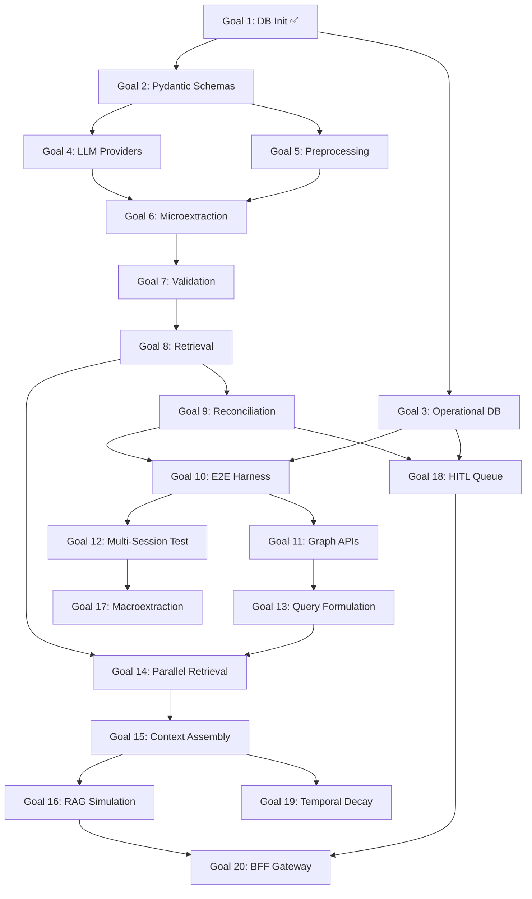

# Lumen Master Implementation Plan

This document outlines the systematic, stage-by-stage implementation plan for the Lumen project, broken down into 20 distinct, testable goals. The architecture is prioritized to build from the ground up: Foundation → Extraction → Graph Testing → Query → Insights. All development occurs within the `lumen/` directory as specified in [`docs/hld/Technical_HLD.md`](file:///Users/hemangmishra/Projects/Lumen/docs/hld/Technical_HLD.md).

**Tech Stack:** Python 3.13, uv (package manager), Kuzu (graph), Qdrant (vector), SQLite (operational), FastAPI (API), Pydantic v2 (schemas).

**Testing:** All goals use `pytest` + `pytest-cov`. Minimum 90% coverage target for new code.

---

## Phase 1: Foundation & Databases (Goals 1-4)
**Objective:** Establish the data layer, schemas, and provider abstractions before touching any LLM logic.

- [x] **Goal 1: Database Initialization Protocol** ✅
  - Implemented `lumen/graph/provider.py` (GraphProvider Protocol), `lumen/graph/kuzu_impl.py` (KuzuGraphProvider with EDGE_REGISTRY), `lumen/vector/provider.py` (VectorProvider Protocol), `lumen/vector/qdrant_impl.py` (QdrantVectorProvider), and `lumen/config.py` (AppConfig).
  - Added `__init__.py` to all packages for proper Python package structure.
  - *Result:* 38 tests passing, 98% coverage. All 15 node tables and 43 edge tables created.
  - *Plan:* [`implementation/Goal_1_Plan.md`](file:///Users/hemangmishra/Projects/Lumen/implementation/Goal_1_Plan.md)

- [x] **Goal 2: Pydantic Schema Contracts** ✅
  - Implemented `lumen/schemas/{enums,base,ids,nodes,edges,pipeline}.py`: 15 node models,
    20 logical edge models + physical-table resolver, 9 pipeline DTOs, ~29 enums.
  - Added `COGNITIVE_DISTORTION_STATE`, `EXISTENTIAL_REFLECTION`, `IDENTITY_FUSION_STATE`
    to [`docs/Extraction/Microextraction.md`](file:///Users/hemangmishra/Projects/Lumen/docs/Extraction/Microextraction.md)'s enum dictionary (previously referenced by `Architecture.md` but undefined).
  - Refactored `GraphProvider.write_node()` / `KuzuGraphProvider.write_node()` to accept
    a Pydantic node model or a raw dict.
  - Redesigned the LLM routing concept per explicit user decision: replaced the old
    `RoutingTier` (`STANDARD`/`HIGH_SECURITY`, privacy-based) with `ModelRole`
    (`LIGHTWEIGHT`/`THINKING`/`EMBEDDING`/`TRANSCRIPTION`/`TTS`, capability-based).
    Added `ProviderConfig` to `lumen/config.py` as the single point of configuration —
    each role independently maps to a `(provider, model)` pair; the abstraction never
    assumes or enforces deployment locality. `DecisionAuditNode.routing_tier` renamed
    to `model_role`. Updated `Schema.md`, `Reconciliation.md`, `Preprocessing.md`,
    `Technical_HLD.md` §2.7, `LLM_Abstraction_Architecture.md`, `HLDv2.md`, and
    `LUMEN_CONTEXT.md` to match — this removes the previously-documented episode-level
    `HIGH_SECURITY` cascading-routing feature entirely (was a stated privacy guarantee;
    now privacy is a pure operator/deployment configuration choice, not a runtime
    content-routing decision).
  - Renamed `source_observation_id` → `source_node_id` on `DecisionAuditNode`,
    `ReconciliationResult`, and `RetrievalResult` — reconciliation can be triggered
    by an `EventNode`/`SessionNode`, not only an `ObservationNode`. Extended
    `branches_to` to support new `BeliefNode` creation (`branches_to_*_bel`), not
    just `PatternNode` — `Reconciliation.md` always said BRANCH could create "a
    genuinely new pattern, belief, or domain" but the edge schema never backed the
    belief case. `EDGE_REGISTRY` now has 47 physical edge tables (was 44, originally
    documented as 43).
  - *Result:* 222 tests passing (38 Goal 1 + 184 new), 100% coverage on `lumen/schemas/`
    and `lumen/config.py`. Found and flagged: Kuzu's edge DDL has no columns for
    `dialectic`/`regulates` edges' required `tension_summary`/`regulation_summary`
    fields (blocks Goal 9 until resolved).
  - *Plan:* [`implementation/Goal_2_Plan.md`](file:///Users/hemangmishra/Projects/Lumen/implementation/Goal_2_Plan.md)

- [x] **Goal 3: Operational DB Setup (SQLite + SQLAlchemy)** ✅
  - Implemented `lumen/operational/{enums,models,engine,schemas,repositories,sqlalchemy_impl,migrator}.py`
    — 8 tables, 5 repository Protocols, one SQLAlchemy implementation, Alembic migrations.
  - `session_buffer` became two tables (buffer + ordered messages); `pipeline_jobs` became
    three (`pipeline_jobs`, `pipeline_stage_runs`, `pipeline_write_log`) so per-stage metrics,
    stage replay, and the trace→graph mapping each get the shape they need.
  - Repositories accept and return Pydantic records; no ORM object leaves the package.
    A unit-of-work session manager lets several repositories share one transaction.
  - Alembic is the sole schema path — tests run `upgrade head`, and a drift test
    (`compare_metadata`) fails if `models.py` and the migration disagree.
  - `api_keys` deferred to Goal 4; HITL cap/snooze/auto-resolve deferred to Goal 18;
    erasure anonymization pass deferred to Goal 19.
  - *Amended by Goal 4:* `api_keys` was **cancelled**, not deferred — credentials come from
    environment variables and are never persisted. `resolve_provider_config()` and the
    `providers.*` settings keys were removed with it; provider selection is a deployment
    property, not a user setting. See `Goal_3_Plan.md` C7.
  - *Result:* 429 tests passing (222 from Goals 1–2 + 213 new, −6 from the Goal 4 amendment),
    100% coverage on `lumen/operational/` and `lumen/observability/`.
  - *Plan:* [`implementation/Goal_3_Plan.md`](file:///Users/hemangmishra/Projects/Lumen/implementation/Goal_3_Plan.md)

- [x] **Goal 3b: Structured Logging & Trace ID Infrastructure** ✅
  - Implemented `lumen/observability/{trace,logging}.py` — `ContextVar`-based trace ids,
    `bind_trace()` / `span()`, a JSON log formatter, and a handler-level trace filter.
  - Because the filter sits on the handler rather than on individual loggers, Goal 1's
    existing `kuzu_impl`/`qdrant_impl` log calls emit traced JSON with no code change.
  - `PipelineDTO.trace_id` now defaults from the run context, so stages never pass it by hand.
  - **Decided:** `trace_id` is *not* stored on graph nodes/edges. `pipeline_write_log` records
    what each run wrote, giving both `trace → nodes` and `node → trace`. `Technical_HLD.md`
    §10 and §4.1 updated to match (they previously specified a column that no table had).
  - *Test:* Mock 3-stage run asserts one id reaches logs, DTOs, and DB rows; two concurrent
    runs on separate threads are proven not to leak into each other.

- [x] **Goal 4: LLM Provider Abstraction Layer** ✅
  - Implemented `lumen/providers/protocols.py` (all four Protocols — the Master Plan originally
    named `llm_provider.py`, but the file holds the embedding and audio Protocols too),
    `lumen/providers/gemini.py`, `lumen/providers/ollama.py`, plus `errors.py`, `retry.py`,
    `telemetry.py`, `fake.py`, `factory.py`.
  - Implemented a role-resolution factory reading `lumen.config.ProviderConfig` (Goal 2):
    resolves a `ModelRole` to a concrete Protocol-conforming provider instance. No
    content-sensitivity branching — role selection is purely task-driven.
  - **Three roles get implementations** (`LIGHTWEIGHT`, `THINKING`, `EMBEDDING`);
    `TRANSCRIPTION` and `TTS` get Protocols only, until voice ingestion needs them.
  - Implemented embedding providers behind the `EMBEDDING` role: `text-embedding-004`
    (Gemini) and `nomic-embed-text` (Ollama) as swappable options.
  - **Configuration is maintainer-owned and deployment-time**: read from env vars at process
    start, never from `user_settings`, with credentials from the environment only. There is
    no `api_keys` table (cancelled — see Goal 3 amendment above).
  - Ship a `FakeLLMProvider`/`FakeEmbeddingProvider` in the package so Goals 5–10 can run
    end-to-end offline.
  - *Amends Goal 2's `config.py` (done):* every env var is now read when a config object is
    **constructed**, not when the module is imported — the old form silently ignored anything
    set after first import, and made the documented per-role override untestable. Credentials
    are exposed as a property rather than a field so they cannot reach
    `pipeline_jobs.config_snapshot` via `asdict()`. +24 tests; suite 429 → 453.
  - *Test:* Mock the vendor SDKs, verify prompt/response contracts, test that each role
    resolves to its configured provider and that roles are independently overridable.
    Opt-in `@pytest.mark.live` suite for real API smoke tests, deselected by default.
  - Added `lumen/providers/base.py` (not originally planned): the send/retry/time/unpack/log
    sequence lives there once, so each vendor supplies only request shaping and reply parsing.
    The fakes share it too, so tests exercise the production path.
  - *Result:* 799 tests passing (453 from Goals 1–3b + 346 new), **100% coverage** on
    `lumen/providers/` and `lumen/config.py`. Four bugs caught during implementation, including
    an unbounded `Retry-After` that could stall a run for an hour, and a shared `contextvars`
    context that fails only under real thread contention.
  - *Plan:* [`implementation/Goal_4_Plan.md`](file:///Users/hemangmishra/Projects/Lumen/implementation/Goal_4_Plan.md)

## Phase 2: Extraction Pipeline (Goals 5-9)
**Objective:** Build the core pipeline that transforms raw conversational input into structured graph actions. Each stage is a pure function (HLD Rule 2): accepts Pydantic input, returns Pydantic output.

- [x] **Goal 5: Stage 0 — Preprocessing** ✅
  - Implemented `lumen/pipeline/preprocessing/` as a package (`stage`, `transcript`, `fillers`,
    `contracts`, `prompts`, `passes`) rather than the single `preprocessing.py` named above —
    seven separable concerns that would otherwise be one 700-line file. `preprocess()` remains
    the only public name.
  - Input: `SessionDecayEvent` → Output: `PreprocessingResult`. A pure function: no DB handle,
    both LLM providers injected, runs offline against `FakeLLMProvider`.
  - **Four LLM passes, not one:** `CONVERSATION` (chat only, THINKING) rolls a dialogue up to
    its settled conclusions; `NORMALIZE` (LIGHTWEIGHT) cleans and translates; `STRUCTURE`
    (THINKING) segments into episodes and builds the coreference map; `TRIAGE` (LIGHTWEIGHT)
    scores each episode and writes reflection prompts. Cost is 1 / 3 / 4 calls per session
    depending on length and whether it was a conversation.
  - **ASR cleaning is hybrid:** regex strips only the ten hesitation spellings that can never
    mean anything; everything needing judgement (`like`, `right`, self-corrections) goes to
    the model, because the documented preservation rule is stated in terms of syntactic
    dependency and regex cannot evaluate it.
  - **The gate runs before segmentation, the score after it.** A word count short-circuits
    short entries with no reasoning call; above threshold, each episode is scored on its own,
    so one session can hold both `REFLECTION` and `RAW_CAPTURE` episodes.
  - **`DISCARD` is defined for the first time** — it fires only on a structural condition
    (nothing extractable survives filtering and cleaning), never on a coherence score. No
    model gets a vote in the one decision that throws input away.
  - **Every pass has a conservative fallback**, so a model failure loses quality but never the
    entry, and never promotes anything: failed segmentation keeps the entry whole, failed
    scoring routes to `RAW_CAPTURE`.
  - *Amends Goal 2's DTOs:* `SessionDecayEvent.source_modality` (without it Stage 0 cannot tell
    voice from typed text), `PreprocessedEpisode.episode_id` and `.episode_summary` (both
    required downstream, neither had a producer). Adds `PipelineConfig` to `AppConfig`.
  - *Docs amended ahead of coding:* `Architecture.md` (segmentation and coreference belong to
    Stage 0, not Stage 1; sub-threshold entries route to `RAW_CAPTURE`, not HITL),
    `Preprocessing.md` (the `DISCARD` rule, LLM-based language detection replacing fastText,
    reflection prompts sourced from cleaned text, Semantic Day Grouping and multi-day splitting
    moved to the ingestion layer), `Microextraction.md` (coreference example corrected to the
    shipped shape; themes/era arrive from Stage 0), `Technical_HLD.md` §5.
  - *Flagged, not fixed:* `Preprocessing.md` says `RAW_CAPTURE` extracts `CONTEXT` only;
    `Microextraction.md` says `CONTEXT` and `EMOTION`. Goal 6 owns that path and resolves it.
  - *Result:* 968 tests passing (799 from Goals 1–4 + 169 new), **100% coverage** on
    `lumen/pipeline/`, `lumen/config.py`, and `lumen/schemas/pipeline.py`.
  - *Plan:* [`implementation/Goal_5_Plan.md`](file:///Users/hemangmishra/Projects/Lumen/implementation/Goal_5_Plan.md)

- [x] **Goal 6: Stage 1 — Microextraction Core** ✅
  - Implemented `lumen/pipeline/extraction/` as a package (`stage`, `passes`, `validation`,
    `assembly`, `catalog`, `contracts`, `prompts`) rather than the single `extraction.py`
    named above — same call Goal 5 made, for the same reason. `extract()` is the only
    public name.
  - Input: **`MicroextractionInput`** → Output: `ExtractionResult`. A new stage-boundary DTO:
    `PreprocessedEpisode` carries no date, coreference map or modality, while every node this
    stage builds requires `occurred_at`. A pure function — no DB, no graph, no history.
  - **Two paths, one call each:** a `REFLECTION` episode gets one THINKING call producing
    observations, events and causal chains together; a `RAW_CAPTURE` episode gets one
    LIGHTWEIGHT call. The path is chosen from `entry_class`, which Stage 0 already decided.
  - **Goal 6 validates, Goal 7 retries** (per explicit user decision). 13 rules enforced per
    *item*: one invented type costs one observation, not the reply. Nothing is ever filled in.
    `validation_passed` is false whenever anything was dropped or nothing survived — the flag
    Goal 7 reads.
  - **Resolves the `RAW_CAPTURE` conflict Goal 5 flagged:** `CONTEXT` **and** `EMOTION`, but
    the emotion only when the person named a feeling themselves. Enforced mechanically — the
    model must return the verbatim quote, and an emotion whose quote is not in the episode
    text is dropped.
  - **The causal anchor is minted in code.** One `SessionNode` per `REFLECTION` episode, so
    Schema rule 5 (no EVOLVE without an intervening Event/Session) is a guarantee rather than
    a model judgement. `EventNode`s are still extracted from content.
  - **Three defences against invention**, all mechanical: `raw_evidence` quotes checked
    against the source text and counted when absent; a `person_ref` naming someone who appears
    nowhere in the entry is stripped; `PROSODY_SIGNAL` is excluded from the prompt and
    discarded in code, since the stage only ever sees a transcript.
  - *Amends Goal 5:* `PreprocessingResult.co_created_spans` — Stage 0's conversation pass
    detected which turns adopted an AI framing and then discarded the wording when it rolled
    the dialogue into a summary, leaving `provenance: CO_CREATED` with no possible input.
    Session-scoped like `coreference_map`, since segmentation happens later. Adds
    `make_scoped_node_id()` (`obs_2026_06_11_01_003`) — two episodes of one day are extracted
    by independent calls that both count from 1 and would otherwise collide.
  - *Docs amended ahead of coding:* `Microextraction.md` (the `RAW_CAPTURE` rule, `OPEN_LOOP`
    as an observation, provenance sourced from the adopted spans), `Preprocessing.md` (same
    `RAW_CAPTURE` rule, `co_created_spans`), `Architecture.md` (**re-extraction limit is 3,
    not 1** — it contradicted `Reconciliation.md`; the mandatory signal-floor list completed
    from 3 types to the 6 shipped; `OpenLoopNode` creation moved to Reconciliation; the
    session anchor recorded), `Technical_HLD.md` §5, `Schema.md` §3.1.
  - *Result:* 1151 tests passing (968 from Goals 1–5 + 183 new), **100% coverage** on
    `lumen/pipeline/`, `lumen/config.py`, `lumen/schemas/pipeline.py`, `lumen/schemas/ids.py`.
  - *Plan:* [`implementation/Goal_6_Plan.md`](file:///Users/hemangmishra/Projects/Lumen/implementation/Goal_6_Plan.md)

- [x] **Goal 7: Post-Extraction Validation Layer** ✅
  - Implemented `lumen/pipeline/extraction/retry.py` plus a correction prompt, correction
    validation, and failure records. Goal 6 already validated every item and dropped what
    broke a rule; this goal asks again for what a second question could plausibly fix, and
    keeps what it cannot.
  - **A correction re-asks only the refused items**, quoted back with the rule each broke.
    Items that already validated are never re-rolled, so the output is stable across
    attempts. Three attempts in total — the first reading plus two corrections.
  - **The retryable set is a frozen table of five rules**, and what is absent from it is the
    point. `QUOTE_NOT_FOUND` — the Goal 6 rule that drops a feeling the person never put
    into words — is **never** re-asked: the correction would be a direct instruction to
    produce the missing quote, and the produced one would pass the check it exists to fail.
    Four other rules are terminal for duller reasons (audio-only types, wrong path,
    one-step chains, over-limit truncation). Terminal rejections are discarded, not failed.
  - **A failed item becomes a real `ObservationNode`** with `status: EXTRACTION_FAILED`, its
    content untouched, typed `CONTEXT` because the type is usually the thing that was wrong,
    with the attempted type and the refusing rule preserved in `raw_evidence` for the review
    card. Returned on a separate `failed_observations` list so nothing downstream can mistake
    one for a real finding.
  - **An unreadable reply is re-read rather than corrected** — there is nothing to correct —
    and after the last attempt `read_failed` says so, so Goal 10 can mark the episode
    `SUSPENDED` instead of storing one that merely looks empty. Nothing is ever invented.
  - **A correction that recovers nothing ends the loop.** A model that returned an unusable
    answer once returns it again; the remaining call only pays to watch it happen.
  - *Amends Goal 6:* `ExtractionResult.failed_observations` and `.read_failed`;
    `retry_count` and `extraction_attempt` now record what actually happened rather than
    being fixed at 0 and 1. `validation_passed` now means *something was lost for good*, so
    a fully recovered reading is trusted again.
  - *Docs amended ahead of coding:* `Reconciliation.md` (**"3 re-extractions" against "on the
    third failure" resolved to three total attempts** — the same paragraph said both),
    `Architecture.md` (the retryable/terminal table with the reason each rule sits where it
    does), `Schema.md`, `Technical_HLD.md` §5.
  - *Flagged, not fixed:* `hitl_queue.audit_node_id` is `NOT NULL` and unique, but an
    extraction failure never reaches Reconciliation and so has no `DecisionAuditNode` —
    which cannot be built honestly for one. Recorded in `Schema.md` §9 for Goal 18. Also:
    the `failed_extraction` edge is `EpisodeNode → ObservationNode` only, so a failed *event*
    or *chain* has nowhere to be recorded and is discarded with a warning.
  - *Result:* 1253 tests passing (1151 from Goals 1–6 + 102 new), **100% coverage** on
    `lumen/pipeline/`, `lumen/config.py`, `lumen/schemas/pipeline.py`.
  - *Plan:* [`implementation/Goal_7_Plan.md`](file:///Users/hemangmishra/Projects/Lumen/implementation/Goal_7_Plan.md)

- [x] **Goal 8: Stage 2 — Retrieval (HyDE + Structural)** ✅
  - Implemented `lumen/pipeline/retrieval/` as a package (`stage`, `hyde`, `semantic`,
    `structural`, `hydrate`, `merge`, `contracts`, `prompts`). Input: `ExtractionResult` →
    Output: **a list of** `RetrievalResult`, one per searchable node — the Master Plan's
    singular signature was never possible.
  - **Providers are injected, like the language models.** `retrieve()` takes `GraphProvider`,
    `VectorProvider` and `EmbeddingProvider` as parameters. `Technical_HLD.md` §8 now says
    the purity rule is about writes and hidden state, not about reading — as written it read
    as though this stage could not exist.
  - **Pass A:** one batched HyDE call writes a hypothetical historical record per extracted
    node, one `embed_batch` turns them into vectors. A rich episode costs 2 calls, not 40.
    Results are hydrated from the graph, filtered, ranked on closeness × signal weight, and
    cut — with more fetched than kept, so a weighty node just below the cut on raw distance
    can climb back above it.
  - **Pass B:** three anchor lookups that read no text at all — by named person, by era tag,
    and for weighty material whose episode is still awaiting reconciliation. That third one
    is why this half exists: someone describing recovery uses none of the words they used
    describing the injury, so no measure of distance will ever connect the two.
  - **`search_failed` on the result.** A search that returns nothing and a search that could
    not run look identical from outside, and Stage 3 answers both by writing a new node —
    correct for the first, and for the second it records a long-standing pattern as a fresh
    discovery, permanently and silently.
  - *Amends Goal 1:* `hybrid_search` returns `ScoredHit` instead of bare ids — it was
    discarding the similarity that `CandidateNode` requires. `GraphProvider` gains three
    narrow anchor reads (no general query method: that would leak graph-shaped thinking into
    the pipeline). **`lumen.graph` and `lumen.vector` now export only their Protocols** —
    naming a Protocol was executing the package `__init__` and importing the vendor driver,
    so the pipeline was transitively importing both databases to name two types.
  - *Amends Goal 2:* `StructuralAnchorType.HIGH_SENSITIVITY_OPEN` — the retrieval spec has
    described three anchors all along and the enum had two, which would have failed
    `DecisionAuditNode`'s validator in Goal 9. Adds `RetrievalResult.search_failed` and four
    `PipelineConfig` limits.
  - *Docs amended ahead of coding:* `Architecture.md` (**the score formula split by layer** —
    it listed four factors while `Schema.md` listed three and the Master Plan put two of them
    in Goal 19; **Pass B's third anchor named a field that does not exist** on the node types
    it names, now stated as the two-hop lookup through the episode; sparse search called out
    as not enabled), `Schema.md`, `Technical_HLD.md` §8 and §5.
  - **Tested against real embedded Kuzu and Qdrant**, seeded per test, since every question
    this stage asks is a query and a stand-in would agree with whatever it was told.
  - *Result:* 1395 tests passing (1253 from Goals 1–7 + 142 new), **100% coverage** on
    `lumen/pipeline/`, `lumen/config.py`, `lumen/schemas/pipeline.py`.
  - *Plan:* [`implementation/Goal_8_Plan.md`](file:///Users/hemangmishra/Projects/Lumen/implementation/Goal_8_Plan.md)

- [x] **Goal 9: Stage 3 — Reconciliation Logic** ✅
  - Implemented `lumen/pipeline/reconciliation/` as a package (`stage`, `decide`, `gates`,
    `plan`, `promote`, `people`, `catalog`, `contracts`, `prompts`) rather than the single
    `reconciliation.py` named above — same call as Goals 5–8. `reconcile()` is the only
    public name.
  - Input: `ExtractionResult` + `list[RetrievalResult]` → Output: **`ReconciliationOutcome`**,
    a new DTO. An episode produces many decisions, many audit nodes, and the writes they
    imply; they have to arrive together or Goal 10 cannot execute them atomically.
  - **Stage 3 decides and builds; it writes nothing.** It returns a `GraphWritePlan` — the
    exact nodes, edges and bookkeeping the decisions imply, fully built and validated —
    which Goal 10 executes without interpreting. The plan checks its own consistency on
    construction, so a dangling reference fails while planning rather than halfway through
    saving.
  - **One cheap call per episode, one deep call for anything consequential** (per explicit
    user decision). `EVOLVE`/`CONTRADICT`/`DIALECTIC` are re-asked with the THINKING model,
    which may confirm, lower confidence, or overrule downward — it is shown only the risky
    items, so it can never make one heavier. Typical cost: 1 call; 2 when something is
    claimed to have changed.
  - **Seven gates enforced in code after the model answers**, in a fixed order: is the
    action structurally possible (falls to the runner-up, then to review), is it a tie
    (<0.05 → AMBIGUOUS), is it a first deviation from a belief older than 180 days
    (→ recorded separately, with a named-breakthrough bypass), is it a short spike inside a
    longer stretch, does a change have a cause, does the action carry the sentence it needs,
    and is it confident enough. Below-threshold is **never** downgraded to BRANCH.
  - **Only claim-like observation types become standing records** (per explicit user
    decision). A frozen table covers all ~50 types with a completeness test; the ~30
    non-promotable ones still reconcile — they can MERGE, REINFORCE or REGULATE — but never
    create a new belief or pattern.
  - **Person records and open-loop promotion ship here** (per explicit user decision). This
    closes the loop Goal 8 left open: its named-person anchor had nothing to find because
    nothing had ever created a person record. Cross-entry alias matching stays deferred.
  - **The append-only rule is restated as what it means: no *content* field is ever
    modified** (per explicit user decision). Three named bookkeeping operations —
    `mark_superseded`, `record_reinforcement`, `touch_person` — touch fixed counters,
    timestamps and version status with no caller-supplied field names. Named openly in
    `Schema.md` rather than left as a hidden exception.
  - **An undecidable item waits alone** (per explicit user decision). The rest of the
    episode is written; the episode is marked `SUSPENDED` to say something is outstanding.
    `find_unresolved_high_signal` was widened to match, or it would stop finding exactly
    the items this stage sets aside.
  - **Goal 8's `search_failed` is honoured:** an item whose search failed is never branched
    and never even asked about — it waits for a person, since novelty cannot be claimed
    from a search that did not run.
  - *Amends Goal 1/2:* the `dialectic` and `regulates` edge tables gain the summary columns
    Goal 2 flagged as blocking this goal (writing either would have failed); `decided_by_sess`
    added — a session is one of three things this stage decides about and was the only one
    unable to record its own decision (47 → 48 physical edge tables); `count_prior_decisions`
    plus the three bookkeeping writes added to `GraphProvider`. `HitlEntryType` moved to
    `schemas/enums.py` so the pipeline names it without importing SQLAlchemy.
  - *Docs amended ahead of coding:* `Reconciliation.md` (**"Rule R5"/"Rule R6" never
    existed** — the table has always had three and R6's text was word-for-word R3's;
    **`LOCAL_EXTREMUM`/`BASELINE_SHIFT` name tags nothing in the system produces**, restated
    as a per-item judgement the decision call returns; **rollback pointed at an edge id that
    does not exist** — edges have no id column, so `decision_id` is the handle; the promotion
    table; the two-call model policy; partial suspension), `Architecture.md`, `Schema.md`
    (the bookkeeping exception, the two edge columns, `decided_by_sess`, `evidence_count` as
    stored rather than derived), `Technical_HLD.md` §5 and §8.
  - *Result:* 1649 tests passing (1395 from Goals 1–8 + 254 new), **100% coverage** on
    `lumen/pipeline/reconciliation/`, `lumen/schemas/pipeline.py`, and `lumen/config.py`.
  - *Plan:* [`implementation/Goal_9_Plan.md`](file:///Users/hemangmishra/Projects/Lumen/implementation/Goal_9_Plan.md)

## Phase 3: Graph Construction & E2E Testing (Goals 10-12)
**Objective:** Tie the extraction pipeline to the databases, execute full runs, and manually inspect the graph.

- [x] **Goal 10: End-to-End Extraction Pipeline Harness** ✅
  - Implemented `lumen/pipeline/orchestration/` as a package (`runner`, `episode`,
    `compose`, `embed`, `commit`, `contracts`, `bookkeeping`) rather than the single
    `orchestrator.py` named above — same call as Goals 5–9. `run_pipeline()` and
    `repair_index()` are the only public names.
  - Input: `SessionDecayEvent` → Output: **`RunReport`**, carrying one `EpisodeOutcome`
    per episode. Every store and model is injected, so the signature is a complete
    statement of what a run can touch.
  - **A plain synchronous function, not a queued task** (per explicit user decision).
    Redis/RQ and the idle-conversation watcher move to Goal 20, where a long-running
    process exists to host them; Goals 11–12 want ordered runs anyway.
  - **An episode saves whole or not at all** (per explicit user decision). Added
    `GraphProvider.transaction()` — the database always supported it and we had never
    exposed it. Nesting is refused rather than silently flattened.
  - **Episodes fail independently** (per explicit user decision). One bad topic does not
    cost the other three; the `follows_from` chain is built against the last episode that
    actually committed, never one whose transaction was rolled back.
  - **The orchestrator writes the half Stage 3 never sees:** the `EpisodeNode` — which
    nothing had ever created despite every stage naming it — plus `contains_*`,
    `chain_contains`, `failed_extraction` and `follows_from`. Merged with Stage 3's plan
    into one `GraphWritePlan`, so its three validators cover the whole episode.
  - **Vectors are computed before the transaction opens** (per explicit user decision), so
    an embedding failure costs nothing. Only the index write happens after the commit; if
    it fails the records are kept, the run reports failure, and `repair_index()` recovers
    them from the write log — node writes and vector writes are logged separately, so the
    difference between the two lists *is* the repair set. `INDEXED_NODE_TYPES` **is**
    retrieval's `CONTENT_TABLES`, asserted identical, so the two cannot drift.
  - **Re-running skips whole episodes, not just their saving** (per explicit user
    decision). Skipping only the write would re-decide an entry against a graph holding
    its own previous conclusions and record it as a repeat of itself.
  - **Undecided items reach the review queue now** (per explicit user decision), keyed on
    the audit node so a re-run never asks twice. Cap/snooze/auto-resolve stay Goal 18's;
    extraction failures still cannot be queued (`hitl_queue.audit_node_id` is `NOT NULL`
    and they have no audit node).
  - **The coreference map finally has a home** (per explicit user decision): a
    `coreference_maps` table in the operational DB, id derived as `coref_<entry_id>`.
    `EpisodeNode.coreference_map_id` had always pointed at something nothing stored.
  - *Amends Goal 9:* audit ids are now episode-scoped (`d_2026_06_11_01_001`) — two
    episodes of one day both numbered their notes from one and collided on a duplicate
    key, a bug only reachable once something ran two episodes in a row. *Amends Goal 5:*
    `PreprocessingResult.detected_languages` — `EpisodeNode.language_tags` had no producer,
    so a Hindi entry would be stored as English with nothing saying it was translated.
    *Amends Goal 1:* Kuzu rollback tolerates the database having already abandoned the
    transaction, which was replacing every real failure with a complaint about cleanup.
    *Amends Goal 3:* `episode_id` on `pipeline_stage_runs` and `pipeline_write_log`,
    uniqueness moved to `(job, stage, episode, attempt)`, migration `0002_orchestration`.
    `PipelineStage` moved to `schemas/enums.py` — the same move Goal 9 made for
    `HitlEntryType`.
  - *Narrowed, not deleted:* Goals 5 and 6 asserted that nothing in `lumen/pipeline/`
    imports `lumen.operational`. That rule protects stage purity, and persistence is the
    orchestrator's entire job; both guards now name the four stage packages individually.
  - *Test:* A real journal entry read from a file produces episode/observation/event/
    session/pattern/person/audit records in a real Kuzu database and matching vectors in a
    real Qdrant collection — verified by reading both stores back, not by trusting the
    report.
  - *Result:* 1799 tests passing (1649 from Goals 1–9 + 150 new), **100% coverage** on
    `lumen/pipeline/orchestration/` and `lumen/operational/`, 98% on `lumen/graph/`.
  - *Plan:* [`implementation/Goal_10_Plan.md`](file:///Users/hemangmishra/Projects/Lumen/implementation/Goal_10_Plan.md)

- [ ] **Goal 11: Graph Read/Debug APIs**
  - Implement graph traversal queries in `lumen/graph/kuzu_impl.py` (multi-hop, time-range, domain filter).
  - Expose in `lumen/api/routes/graph.py` as FastAPI endpoints.
  - *Test:* Programmatically traverse the graph to verify edges, version chains, and causal anchors.

- [ ] **Goal 12: Multi-Session Integrity Test**
  - Feed 3–5 consecutive days of simulated journal logs.
  - Verify: patterns accumulate `evidence_count`, version chains link correctly, `follows_from` edges order episodes.
  - *Test:* Traverse Kuzu graph to ensure patterns aren't fragmented across sessions.

## Phase 4: Query Layer (Goals 13-16)
**Objective:** Build the real-time, invisible RAG injection system per [`docs/Query/Conversational_RAG_Mode.md`](file:///Users/hemangmishra/Projects/Lumen/docs/Query/Conversational_RAG_Mode.md).

- [ ] **Goal 13: Query Formulation Layer**
  - Implement the lightweight query classifier (gemini-2.5-flash, <100ms).
  - Outputs: `NO_TRIGGER` (skip retrieval) or `RetrievalSignal` with trigger type.
  - *Test:* Verify `NO_TRIGGER` for small talk, `PATTERN_MENTION` for pattern-related questions.

- [ ] **Goal 14: Parallel Retrieval Passes (A, B, C)**
  - Pass A: Qdrant hybrid search (HyDE expansion).
  - Pass B: Kuzu structural anchor lookup (named entities, historical eras).
  - Pass C: Session context buffer (in-memory, ephemeral per day).
  - *Test:* Trigger `HISTORICAL_ERA` formulation, verify Pass B retrieves correct nodes.

- [ ] **Goal 15: Context Assembly & Pruning**
  - Merge candidates from all passes, apply retrieval score formula (cosine × signal_weight × recency_weight).
  - Compress to ≤400 token context block.
  - *Test:* Verify assembler respects token budget and applies temporal decay correctly.

- [ ] **Goal 16: Conversational RAG End-to-End Simulation**
  - Implement `lumen/api/routes/chat.py` with streaming WebSocket support.
  - Wire up FormulationService → Retrieval → ContextAssembler → SystemPromptPatcher.
  - 3-second latency budget with carry-forward policy.
  - *Test:* CLI chat simulation, verify AI receives injected context within latency budget.

## Phase 5: Insights & Macro Layer (Goals 17-20)
**Objective:** Build background intelligence processes and the unified API gateway.

- [ ] **Goal 17: Periodic Macroextraction**
  - Implement `lumen/pipeline/macroextraction.py`.
  - Report types: SHADOW (daily), WEEKLY, MONTHLY, QUARTERLY.
  - Write `MacroextractionReportNode` + `analyzed_in` edges.
  - *Test:* Trigger mock "end of week" event; verify report node saved with correct episode coverage.

- [ ] **Goal 18: HITL Queue System**
  - Implement `lumen/api/routes/hitl.py` — card-based review UI endpoints.
  - Configurable queue cap (default 40), 7-day auto-resolve, snooze support.
  - *Test:* Force AMBIGUOUS reconciliation, verify queue entry, resolve manually, verify graph update.

- [ ] **Goal 19: Temporal Decay & Maintenance Jobs**
  - Implement temporal decay weights in retrieval score calculations.
  - Implement `query_frequency` counter increment on retrieval hit.
  - Implement soft-delete/erasure procedure (DPDP/GDPR compliance).
  - *Test:* Simulate 400-day gap, verify retrieval score drops by expected multiplier.

- [ ] **Goal 20: API Gateway (BFF) Integration**
  - Finalize `lumen/api/main.py` (FastAPI) tying all routes: `/chat`, `/ingest`, `/query`, `/graph`, `/hitl`, `/reports`.
  - WebSocket streaming for chat responses and pipeline progress updates.
  - *Test:* Full HTTP lifecycle: Ingest → Pipeline triggers → Query → Chat with RAG context.

---

## Dependencies

