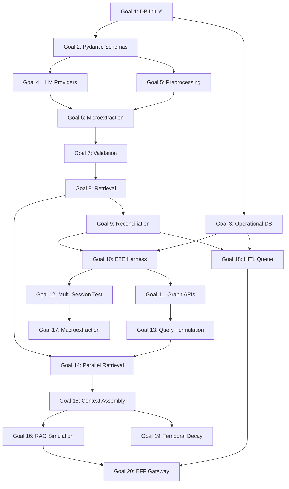

# Lumen Master Implementation Plan

This document outlines the systematic, stage-by-stage implementation plan for the Lumen project, broken down into 20 distinct, testable goals. The architecture is prioritized to build from the ground up: Foundation → Extraction → Graph Testing → Query → Insights. All development occurs within the `lumen/` directory as specified in [`docs/hld/Technical_HLD.md`](file:///Users/hemangmishra/Projects/Lumen/docs/hld/Technical_HLD.md).

**Tech Stack:** Python 3.13, uv (package manager), Kuzu (graph), Qdrant (vector), SQLite (operational), FastAPI (API), Pydantic v2 (schemas).

**Testing:** All goals use `pytest` + `pytest-cov`. Minimum 90% coverage target for new code.

---

## Phase 1: Foundation & Databases (Goals 1-4)
**Objective:** Establish the data layer, schemas, and provider abstractions before touching any LLM logic.

- [x] **Goal 1: Database Initialization Protocol** ✅
  - Implemented `lumen/graph/provider.py` (GraphProvider Protocol), `lumen/graph/kuzu_impl.py` (KuzuGraphProvider with EDGE_REGISTRY), `lumen/vector/provider.py` (VectorProvider Protocol), `lumen/vector/qdrant_impl.py` (QdrantVectorProvider), and `lumen/config.py` (AppConfig).
  - Added `__init__.py` to all packages for proper Python package structure.
  - *Result:* 38 tests passing, 98% coverage. All 15 node tables and 43 edge tables created.
  - *Plan:* [`implementation/Goal_1_Plan.md`](file:///Users/hemangmishra/Projects/Lumen/implementation/Goal_1_Plan.md)

- [x] **Goal 2: Pydantic Schema Contracts** ✅
  - Implemented `lumen/schemas/{enums,base,ids,nodes,edges,pipeline}.py`: 15 node models,
    20 logical edge models + physical-table resolver, 9 pipeline DTOs, ~29 enums.
  - Added `COGNITIVE_DISTORTION_STATE`, `EXISTENTIAL_REFLECTION`, `IDENTITY_FUSION_STATE`
    to [`docs/Extraction/Microextraction.md`](file:///Users/hemangmishra/Projects/Lumen/docs/Extraction/Microextraction.md)'s enum dictionary (previously referenced by `Architecture.md` but undefined).
  - Refactored `GraphProvider.write_node()` / `KuzuGraphProvider.write_node()` to accept
    a Pydantic node model or a raw dict.
  - Redesigned the LLM routing concept per explicit user decision: replaced the old
    `RoutingTier` (`STANDARD`/`HIGH_SECURITY`, privacy-based) with `ModelRole`
    (`LIGHTWEIGHT`/`THINKING`/`EMBEDDING`/`TRANSCRIPTION`/`TTS`, capability-based).
    Added `ProviderConfig` to `lumen/config.py` as the single point of configuration —
    each role independently maps to a `(provider, model)` pair; the abstraction never
    assumes or enforces deployment locality. `DecisionAuditNode.routing_tier` renamed
    to `model_role`. Updated `Schema.md`, `Reconciliation.md`, `Preprocessing.md`,
    `Technical_HLD.md` §2.7, `LLM_Abstraction_Architecture.md`, `HLDv2.md`, and
    `LUMEN_CONTEXT.md` to match — this removes the previously-documented episode-level
    `HIGH_SECURITY` cascading-routing feature entirely (was a stated privacy guarantee;
    now privacy is a pure operator/deployment configuration choice, not a runtime
    content-routing decision).
  - *Result:* 222 tests passing (38 Goal 1 + 184 new), 100% coverage on `lumen/schemas/`
    and `lumen/config.py`. Found and flagged: `EDGE_REGISTRY` has 44 physical edge
    tables, not 43 as previously documented; Kuzu's edge DDL has no columns for
    `dialectic`/`regulates` edges' required `tension_summary`/`regulation_summary`
    fields (blocks Goal 9 until resolved).
  - *Plan:* [`implementation/Goal_2_Plan.md`](file:///Users/hemangmishra/Projects/Lumen/implementation/Goal_2_Plan.md)

- [ ] **Goal 3: Operational DB Setup (SQLite + SQLAlchemy)**
  - Initialize SQLite via SQLAlchemy ORM in `lumen/operational/`.
  - Tables: `session_buffer`, `pipeline_jobs`, `hitl_queue`, `user_settings`, `data_erasure_audit`.
  - Add Alembic for schema migrations.
  - *Test:* Write/read session buffer records, verify pipeline job state transitions.

- [ ] **Goal 3b: Structured Logging & Trace ID Infrastructure**
  - Implement `trace_id` generation (UUID per session entering pipeline) as described in HLD Section 10.
  - Configure structured JSON logging to file.
  - Attach `trace_id` to every log line, Pydantic model, and DB write.
  - *Test:* Verify trace_id propagation across a mock pipeline run.

- [ ] **Goal 4: LLM Provider Abstraction Layer**
  - Implement `lumen/providers/llm_provider.py` (Protocol), `lumen/providers/gemini.py`, `lumen/providers/ollama.py`.
  - Implement a role-resolution factory reading `lumen.config.ProviderConfig` (Goal 2):
    resolves a `ModelRole` (`LIGHTWEIGHT`/`THINKING`/`EMBEDDING`/`TRANSCRIPTION`/`TTS`) to
    a concrete Protocol-conforming provider instance. No content-sensitivity branching —
    role selection is purely task-driven (see `docs/hld/LLM_Abstraction_Architecture.md`).
  - Implement embedding provider(s) behind the `EMBEDDING` role: `text-embedding-004`
    (Gemini) and `nomic-embed-large` (Ollama) as swappable options.
  - *Test:* Mock LLM calls, verify prompt/response contracts, test that each role
    resolves to its configured provider and that roles are independently overridable.

## Phase 2: Extraction Pipeline (Goals 5-9)
**Objective:** Build the core pipeline that transforms raw conversational input into structured graph actions. Each stage is a pure function (HLD Rule 2): accepts Pydantic input, returns Pydantic output.

- [ ] **Goal 5: Stage 0 — Preprocessing**
  - Implement `lumen/pipeline/preprocessing.py` for ASR cleaning, coreference resolution, and episode chunking.
  - Input: `SessionDecayEvent` → Output: `PreprocessingResult`
  - Quality gate: classify each episode as `REFLECTION`, `RAW_CAPTURE`, or `DISCARD`.
  - *Test:* Feed messy transcripts; verify clean `PreprocessedEpisode` output with correct quality classification.

- [ ] **Goal 6: Stage 1 — Microextraction Core**
  - Implement `lumen/pipeline/extraction.py` (LLM prompt + structured JSON extraction).
  - Input: `PreprocessedEpisode` → Output: `ExtractionResult` (list of typed ObservationNodes, EventNodes, etc.)
  - *Test:* Verify extraction of Belief, Pattern, Event, CausalChain nodes from known text blocks.

- [ ] **Goal 7: Post-Extraction Validation Layer**
  - Enforce Pydantic schema validation on all LLM-generated JSON.
  - Implement 3-attempt retry loop with re-extraction on validation failure.
  - Write `failed_extraction` edge on 3rd failure.
  - *Test:* Feed broken/hallucinated JSON; verify errors are caught and retries fire.

- [ ] **Goal 8: Stage 2 — Retrieval (HyDE + Hybrid Search)**
  - Implement `lumen/pipeline/retrieval.py`.
  - Pass A: Semantic search via Qdrant (HyDE expansion).
  - Pass B: Structural retrieval via Kuzu (named persons, historical eras).
  - Input: `ExtractionResult` → Output: `RetrievalResult` (candidate nodes per observation).
  - *Test:* Seed Qdrant + Kuzu, run observation through Stage 2, verify semantic + structural matches.

- [ ] **Goal 9: Stage 3 — Reconciliation Logic**
  - Implement `lumen/pipeline/reconciliation.py`.
  - 8 actions: MERGE, REINFORCE, EVOLVE, BRANCH, CONTRADICT, DIALECTIC, REGULATE, AMBIGUOUS.
  - HITL escalation for AMBIGUOUS tie or below-threshold confidence.
  - Input: `RetrievalResult` → Output: `ReconciliationResult` + `DecisionAuditNode`.
  - *Test:* Provide identical historical node → verify MERGE. Provide evolved version → verify EVOLVE with delta.

## Phase 3: Graph Construction & E2E Testing (Goals 10-12)
**Objective:** Tie the extraction pipeline to the databases, execute full runs, and manually inspect the graph.

- [ ] **Goal 10: End-to-End Extraction Pipeline Harness**
  - Implement `lumen/pipeline/orchestrator.py` — chains Stage 0 → 1 → 2 → 3 → Graph Write → Vector Write.
  - Graph writes go through `GraphProvider` (HLD Rule 3: one write path).
  - *Test:* Run full pipeline on a single text file, verify Kuzu nodes + Qdrant vectors written.

- [ ] **Goal 11: Graph Read/Debug APIs**
  - Implement graph traversal queries in `lumen/graph/kuzu_impl.py` (multi-hop, time-range, domain filter).
  - Expose in `lumen/api/routes/graph.py` as FastAPI endpoints.
  - *Test:* Programmatically traverse the graph to verify edges, version chains, and causal anchors.

- [ ] **Goal 12: Multi-Session Integrity Test**
  - Feed 3–5 consecutive days of simulated journal logs.
  - Verify: patterns accumulate `evidence_count`, version chains link correctly, `follows_from` edges order episodes.
  - *Test:* Traverse Kuzu graph to ensure patterns aren't fragmented across sessions.

## Phase 4: Query Layer (Goals 13-16)
**Objective:** Build the real-time, invisible RAG injection system per [`docs/Query/Conversational_RAG_Mode.md`](file:///Users/hemangmishra/Projects/Lumen/docs/Query/Conversational_RAG_Mode.md).

- [ ] **Goal 13: Query Formulation Layer**
  - Implement the lightweight query classifier (gemini-2.5-flash, <100ms).
  - Outputs: `NO_TRIGGER` (skip retrieval) or `RetrievalSignal` with trigger type.
  - *Test:* Verify `NO_TRIGGER` for small talk, `PATTERN_MENTION` for pattern-related questions.

- [ ] **Goal 14: Parallel Retrieval Passes (A, B, C)**
  - Pass A: Qdrant hybrid search (HyDE expansion).
  - Pass B: Kuzu structural anchor lookup (named entities, historical eras).
  - Pass C: Session context buffer (in-memory, ephemeral per day).
  - *Test:* Trigger `HISTORICAL_ERA` formulation, verify Pass B retrieves correct nodes.

- [ ] **Goal 15: Context Assembly & Pruning**
  - Merge candidates from all passes, apply retrieval score formula (cosine × signal_weight × recency_weight).
  - Compress to ≤400 token context block.
  - *Test:* Verify assembler respects token budget and applies temporal decay correctly.

- [ ] **Goal 16: Conversational RAG End-to-End Simulation**
  - Implement `lumen/api/routes/chat.py` with streaming WebSocket support.
  - Wire up FormulationService → Retrieval → ContextAssembler → SystemPromptPatcher.
  - 3-second latency budget with carry-forward policy.
  - *Test:* CLI chat simulation, verify AI receives injected context within latency budget.

## Phase 5: Insights & Macro Layer (Goals 17-20)
**Objective:** Build background intelligence processes and the unified API gateway.

- [ ] **Goal 17: Periodic Macroextraction**
  - Implement `lumen/pipeline/macroextraction.py`.
  - Report types: SHADOW (daily), WEEKLY, MONTHLY, QUARTERLY.
  - Write `MacroextractionReportNode` + `analyzed_in` edges.
  - *Test:* Trigger mock "end of week" event; verify report node saved with correct episode coverage.

- [ ] **Goal 18: HITL Queue System**
  - Implement `lumen/api/routes/hitl.py` — card-based review UI endpoints.
  - 20-item queue cap, 7-day auto-resolve, snooze support.
  - *Test:* Force AMBIGUOUS reconciliation, verify queue entry, resolve manually, verify graph update.

- [ ] **Goal 19: Temporal Decay & Maintenance Jobs**
  - Implement temporal decay weights in retrieval score calculations.
  - Implement `query_frequency` counter increment on retrieval hit.
  - Implement soft-delete/erasure procedure (DPDP/GDPR compliance).
  - *Test:* Simulate 400-day gap, verify retrieval score drops by expected multiplier.

- [ ] **Goal 20: API Gateway (BFF) Integration**
  - Finalize `lumen/api/main.py` (FastAPI) tying all routes: `/chat`, `/ingest`, `/query`, `/graph`, `/hitl`, `/reports`.
  - WebSocket streaming for chat responses and pipeline progress updates.
  - *Test:* Full HTTP lifecycle: Ingest → Pipeline triggers → Query → Chat with RAG context.

---

## Dependencies

